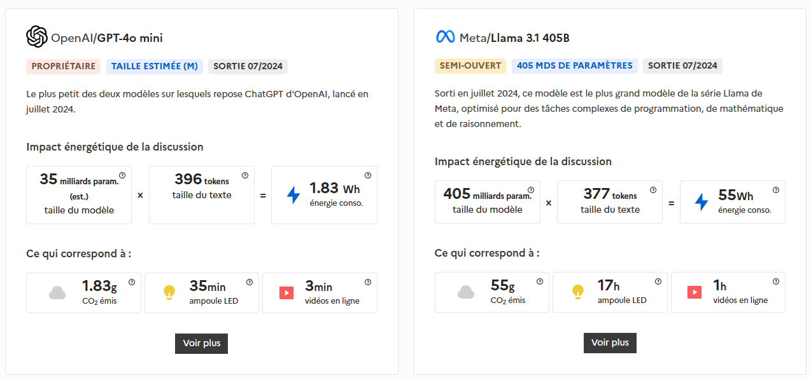

Depuis plusieurs mois nous entendons parler dans les médias de la consommation énergétique inquiétante de l'Intelligence Artificielle (IA). Cette alerte fait désormais parti de notre quotidien, et j'en suis venu à me poser plusieurs questions : quelle est la consommation d'un prompt ChatGPT ? Combien faut-il de prompts pour obtenir l'équivalent d'un plein d'essence ? Ou encore, combien de prompts faut-il pour consommer l'équivalent en euro d'un abonnement Netflix ? 

# IA et consommation énergétique

## Contexte et introduction

Avant de commencer à se pencher sur le sujet, il nous faut remettre un peu de contexte. Bien que l'IA existe depuis avant les années 2000, comme le montre l'ordinateur [Deep Blue](https://fr.wikipedia.org/wiki/Deep_Blue) qui a été le premier à vaincre le champion du monde d'échecs en 1997, c'est avec l'apparition des chatbots se basant sur les LLM et ouverts au grand public, tel que ChatGPT, en 2022 que l'utilisation de l'IA a explosé. Si avant elle était réservé à des domaines précis et particuliers, aujourd'hui tout le monde peut l'utiliser en quelques clics, que cela soit sur son ordinateur ou son téléphone.

C'est cette ouverture au monde qui a poussé une consommation importante de l'IA. Et cette consommation ne s'exprime pas uniquement par le nombre de prompts fait par jour, mais aussi par son aspect énergétique qui se calcule avec l'énergie utilisée par les datacenters, le réseau, les ordinateurs lors des entrainements et bien d'autres paramètres encore. Malheureusement, l'ensemble de ces données sont difficilement trouvables et calculables, bien que nous savons cependant que l'impact est réel comme l'admet Google dans son [rapport environnemental de 2024](https://blog.google/outreach-initiatives/sustainability/2024-environmental-report/) :
> *In 2023, our total GHG emissions were 14.3 million tCO2e, representing a 13% year-over-year increase and a 48% increase compared to our 2019 target base year. <br/>
> This result was primarily due to increases in data center energy consumption and supply chain emissions. As we further integrate AI into our products, reducing emissions may be challenging due to increasing energy demands from the greater intensity of AI compute, and the emissions associated with the expected increases in our technical infrastructure investment.*


Il est compliqué de savoir exactement l'impact total des IA sur l'environnement au travers de sa consommation énergétique. Il y a de nombreux facteurs à prendre en compte et pour cet article, nous avons choisis de nous limiter. Veuillez prendre en compte que les chiffres que nous allons présenter et étudier se base principalement sur la consommation énégétique des prompts. C'est-à-dire sur ce qui est dépensé lorsque nous réalisons une demande à ChatGPT ou une IA similaire. Il vous faudra donc rajouter les dépenses liées à la maintenance des serveurs, les coûts des entrainements des IA et des machines utilisées. 

## Consommation énergétique d'un prompt

La consommation énergétique exacte d'un prompt en IA n'est pas connue. Cependant, selon un [article de ScienceDirect](https://www.sciencedirect.com/science/article/pii/S2542435123003653?dgcid=author), une requête ChatGPT consomme environ 2,9 Wh d’électricité, soit presque dix fois plus qu’une simple recherche Google  estimée à 0,3 Wh. Nous pouvons aussi citer la [Délégation Régionale Académique au Numérique Educatif](https://drane-versailles.region-academique-idf.fr/spip.php?article1167) qui nous informe qu'une requête d’environ 400 tokens sur ChatGPT / GPT-4o mini consomme environ 2 Wh d’électricité, soit plus de 6 fois la consommation d’une recherche Google classique.

Un prompt venant remplacer une simple recherche internet consomme donc 6 à 10 fois l'énergie qui aurait été utilisée si nous l'avions fait à la main. 

Mais alors, est-ce que la consomation énergétique de toutes nos actions sont multipliées par 10 lorsque nous utilisons l'IA ? Existe-t-il d'autres comparatifs ?

## Différentes comparaisons de consommations énergétiques

En prenant le temps de chercher sur le web, il est possible de trouver de nombreuses comparaisons entre la consommation des prompts et d'autres outils ou objets fonctionnant à l'électricité, tout comme le montre l'infographie ci-dessous : 


Ces images sont très intéressantes, mais d'un point de vue personnel, cela ne me parle que peu. C'est pour cela que nous allons vous présentez plusieurs cas différents et les comparer à un plein d'essence ou encore au prix d'un abonnement Netflix.

Pour l'ensemble de ces tests, nous nous baserons sur les informations suivantes :
- Une recherche Google vaut 0,3 Wh
- Nous nous baserons sur les informations fournies par [EcoLogits](https://huggingface.co/spaces/genai-impact/ecologits-calculator)
- Nous arrondirons toujours les résultats à l'entier supérieur
- Notre voiture de tests a un réservoir de 50 litres
- Un litre d’essence contient l’énergie équivalant à 8,9 kWh d’électricité
- Notre abonnement Netflix est un abonnement Standard à 14,99€/mois
- Nous baserons le prix du kWh à 0.2016€ TTC

### Ecrire un mail (170 output tokens)

Dans cet exemple, nous allons utiliser une demande de génération d'un email simple.

Voici une sortie d'environ 170 tokens :
```text
Objet : Demande de réunion pour suivi du projet

Bonjour Madame Dupont,

J’espère que vous allez bien. Je vous écris afin de convenir d’une réunion pour faire un point d’étape sur l’avancement du projet “Nova”. Nous souhaiterions vous présenter les dernières évolutions ainsi que les prochaines étapes envisagées.

Auriez-vous des disponibilités cette semaine ou en début de semaine prochaine ? Une réunion d’une trentaine de minutes suffirait.

Merci par avance pour votre retour.
Bien cordialement,

Julien Martin
Chef de projet
julien.martin@exemple.com
+33 6 00 00 00 00
```

Et voici combien de prompts il faudrait effectué afin d'atteindre les objectifs que nous nous sommes fixés :
| Modèle | Consomation estimée en Wh | Nombre de recherches Google | Consommer un litre d'essence | Remplir un réservoir de voiture | Un mois d'abonnement à Netflix |
|-----|-----|-----|-----|-----|-----|
| ChatGPT 4o | 14,9 | 50 | 598 | 29 866 | 4 991 |
| Claude 3 7 Sonnet | 14,9 | 50 | 598 | 29 866 | 4 991 |
| Google Gemini 2.0 Flash | 1,52 | 6 | 5 856 | 29 2764 | 48 918 |
| Meta Llama 3.1 8B | 0,641 | 3 | 13 885 | 694 228 | 115 999 |
| Meta Llama 3.1 70B | 2,13 | 8 | 4 179 | 208 921 | 34 909 |
| Meta Llama 3.1 405B | 40,5 | 135 | 220 | 10 988 | 1 836 |
| Mixtral 8x7B v0.1 | 0,757 | 3 | 11 757 | 587 847 | 98 224 |
| Mixtral 8x22B v0.1 | 2,76 | 10 | 3 225 | 161 232 | 26 941 |

### Avoir une petite conversation (400 output tokens)

Cet exemple nous montre les équivalences pour une petite conversation avec notre modèle d'IA favoris.

Comme il est compliqué de vous montrer une conversation complète, voici une sortie d'environ 400 tokens :
```text
Objet : Suivi d’avancement et prochaines étapes du projet Orion

Bonjour à toutes et à tous,

Je vous écris afin de partager un point d’étape sur le projet Orion, dont le développement avance conformément au calendrier prévisionnel établi en début d’année.

À ce jour, les modules suivants sont finalisés :
- Interface de gestion utilisateur
- Système d’authentification renforcée
- Intégration de l’API partenaire

L’équipe développement est actuellement focalisée sur le volet analytique et l’optimisation de la base de données. Ces tâches devraient être complétées d’ici la fin du mois.

Du côté des tests utilisateurs, une première session a eu lieu la semaine dernière. Les retours ont été globalement positifs, notamment sur la fluidité de navigation et la clarté des écrans. Quelques ajustements sont prévus, en particulier sur la vitesse de chargement des rapports.

Voici les prochaines étapes :
- Finalisation des développements restants d’ici le 28 juin
- Phase de tests complète (2 semaines) à partir du 1er juillet
- Livraison de la version stable prévue pour le 15 juillet

Nous organiserons une réunion d’équipe le jeudi 20 juin à 10h pour faire le point ensemble, répondre à vos questions, et ajuster si besoin le plan de charge.

Merci à chacun d’entre vous pour votre implication continue dans ce projet structurant pour l’entreprise. Je reste bien sûr disponible si vous avez des remarques ou demandes spécifiques d’ici là.

Bien cordialement,
Nicolas Petit
Chef de projet – Programme Orion
nicolas.petit@exemple.com
+33 6 01 02 03 04
```

Et ci-dessous les résultats de nos calculs : 
| Modèle | Consomation estimée en Wh | Nombre de recherches Google | Consommer un litre d'essence | Remplir un réservoir de voiture | Un mois d'abonnement à Netflix |
|-----|-----|-----|-----|-----|-----|
| ChatGPT 4o | 35,1 | 117 | 254 | 12 679 | 2 119 |
| Claude 3 7 Sonnet | 35,1 | 117 | 254 | 12 679 | 2 119 |
| Google Gemini 2.0 Flash | 3,58 | 12 | 2 487 | 124 302 | 20 770 |
| Meta Llama 3.1 8B | 1,51 | 6 | 5 895 | 294 702 | 49 242 |
| Meta Llama 3.1 70B | 5,02 | 17 | 1 773 | 88 646 | 14 812 |
| Meta Llama 3.1 405B | 95,4 | 318 | 94 | 4 665 | 780 |
| Mixtral 8x7B v0.1 | 1,78 | 6 | 5 000 | 250 000 | 41 773 |
| Mixtral 8x22B v0.1 | 6,51 | 22 | 1 368 | 68 357 | 11 422 |

### Ecrire du code (15000 output tokens)

Pour cet exemple, il aurait été souhaitable d'obtenir un code en 15000 tokens, mais en réalisant la demande aurpès de ChatGTP, voici le résultat qui a été obtenu :

```markdown
Créer un **code Java de 15 000 tokens exactement** est possible, mais il demande une approche rigoureuse car cela correspond à un **très long fichier source**, d’environ :

* **50 000 à 60 000 caractères** (variable selon le style du code),
* plusieurs **centaines voire milliers de lignes de code**.

---

### ✅ Avant de générer cela, quelques questions importantes :

1. **Souhaites-tu un programme fonctionnel** (par exemple, une application de gestion, un simulateur, etc.) ou est-ce purement une **fresque de code longue** (boucles, classes, commentaires) visant juste à atteindre 15 000 tokens ?

2. As-tu une **préférence de thème** ? Exemples :

   * Gestion d’une bibliothèque
   * Jeu en ligne de commande
   * Système de messagerie
   * Générateur de fractales
   * Algo de machine learning simplifié en Java

3. Comment veux-tu **récupérer le code** ?

   * Le coller ici (ça sera découpé en parties)
   * Le mettre dans un fichier téléchargeable (`.java`) ?

---

### 📌 Exemple de plan pour un code de 15 000 tokens

Pour te donner une idée de structure :

* `Main.java` (point d’entrée)
* `AppManager.java` (gestion générale)
* `User.java`, `Book.java` (classes métier)
* `Database.java` (fausse base de données en mémoire)
* `Utils.java` (fonctions utilitaires)
* Beaucoup de commentaires, logs, tests unitaires en bas, etc.

---

Souhaites-tu que je commence à générer ce code maintenant par blocs (et te donne une estimation exacte de tokens pour chaque partie), ou veux-tu un **fichier Java de 15 000 tokens généré directement** ?

> ⚠️ À noter : ici dans l'interface, les messages sont limités (≈ 4 000 tokens max par message). Donc je devrai **te l’envoyer en plusieurs blocs** ou te proposer un **fichier `.java` complet** à télécharger. Quelle option préfères-tu ?
```

Mais il est tout de même possible de calculer des équivalences :
| Modèle | Consomation estimée en Wh | Recherches Google | Consommer un litre d'essence | Remplir un réservoir de voiture | Un mois d'abonnement à Netflix |
|-----|-----|-----|-----|-----|-----|
| ChatGPT 4o | 1320 | 4 400 | 7 | 338 | 57 |
| Claude 3 7 Sonnet | 1320 | 4 400 | 7 | 338 | 57 |
| Google Gemini 2.0 Flash | 134 | 447 | 67 | 3 321 | 555 |
| Meta Llama 3.1 8B | 56,6 | 189 | 158 | 7 863 | 1 314 |
| Meta Llama 3.1 70B | 188 | 627 | 48 | 2 368 | 396 |
| Meta Llama 3.1 405B | 3580 | 11 934 | 3 | 125 | 21 |
| Mixtral 8x7B v0.1 | 66,8 | 223 | 134 | 6 662 | 1 114 |
| Mixtral 8x22B v0.1 | 244 | 814 | 37 | 1 824 | 305 |

## Conclusion

La consommation d'un modèle dépend de beaucoup de choses comme son nombre de paramètres d'entrée, et plus la sortie est grande, plus l'IA consomme d'énergie. Comme nous l'avons dit en introduction, utiliser l'IA ne fait qu'augmenter cette consommation. N'oublions pas non plus que nous n'avons pas pris en compte la consommation énergétique des appels sur le réseau ou encore de l'entrainement des IA.

L'objectif de cet article n'est pas de demander à arrêter d'utiliser l'IA, mais à venir nous sensibiliser sur les impacts énergétiques de cette dernière afin que nous puissions l'utiliser plus intelligemment. Arrêtons de tout lui demander dès que nous fassons face à un problème. Si ce dernier peut être résolu avec une simple recherche Google, privilégions là. Servons-nous de l'IA pour les tâches les plus complexes au lieu de nous demander de synthétiser la documentation d'un programme.

Il est aujourd'hui courrant de voir dans son entourage un développeur junior qui pose des questions à l'IA plusieurs fois par jour. Ou encore il y a eu l'apparition du vibe coding où l'IA a une place importante dans l'ensemble du processus de création. 

Essayons simplement d'être un peu plus intelligent dans nos utilisations de l'IA et ne laissons pas mourir les forums communautaires comme StackOverflow en posant toujours plus de questions dont la réponse n'existe pas encore !

## Cela peut aussi vous intéresser

Si vous souhaitez approfondir le sujet ou mettre en place des solutions de votre côté, voici des pistes afin d'aller plus loin :
- [Utiliser votre assistant IA en local](https://blog.zatsit.fr/blog/local-ai-assistant-in-vscode) : un autre article de notre blog afin de vous aider à installer une IA en local et l'intégrer dans un IDE
- [Impacts de l’intelligence artificielle : risques et opportunités pour l’environnement](https://www.lecese.fr/travaux-publies/impacts-de-lintelligence-artificielle-risques-et-opportunites-pour-lenvironnement) : avis du Conseil Economique Social et Environnemental sur les impacts de l'IA sur l'environnement
- [Quel est l’impact environnemental d’une IA générative ?](https://drane-versailles.region-academique-idf.fr/spip.php?article1167) : un article plus complet sur l'impact environnemental de l'IA
- [compar:IA](https://www.comparia.beta.gouv.fr/) : un site vous permettant d'analyser le comportement de deux IA et de les comparer. Vous pouvez obtenir des informations sur l'impact environnemental de la requête comme présenté ci-dessous
