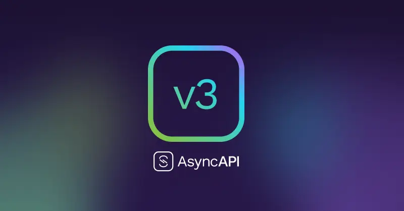

Aprés deux années de travail de la communauté, la version 3.0.0 de la spécification a été publiée, avec le support des outils proposés par l'initiative.

Cette version 3.0.0 apporte son lot de nouveautés, mais aussi des améliorations / refonte de certaines de ces fonctionnalités.

<!-- truncate -->

Pour y découvrir les principaux changements,

👉 Vous pouvez consulter le [changelog](https://www.asyncapi.com/blog/release-notes-3.0.0) de cette version.

👉 Si vous utilisiez déjà la version 2, vous allez devoir migrer vos specifications en V3 et
AsyncAPI a pensé à vous en vous proposant un [guide de migration](https://www.asyncapi.com/docs/migration/migrating-to-v3).

👉 J'ai moi-même contribué à l'effort en prenant part à une migration [du use-case Adeo](https://www.asyncapi.com/casestudies/adeogroup) durant un live avec [@lbroudoux](https://twitter.com/lbroudoux) de chez [Microcks.io](https://microcks.io/) :

Pour plus d'informations, vous pouvez consulter le [site officiel](https://www.asyncapi.com/) de l'initiative.

Ambassadeur de l'initiative depuis 2021, je serai ravi de venir vous la présenter lors d'un meetup, d'un BBL ou d'une conférence.

D'ici là, spécifiez bien vos APIs ! 🚀
