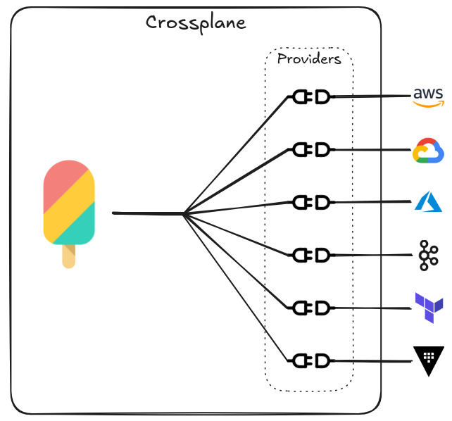
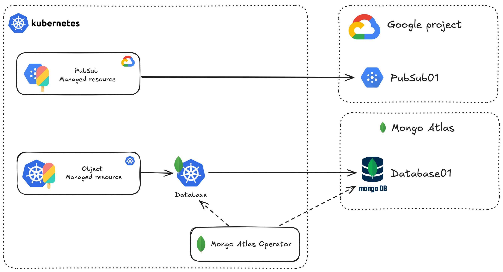
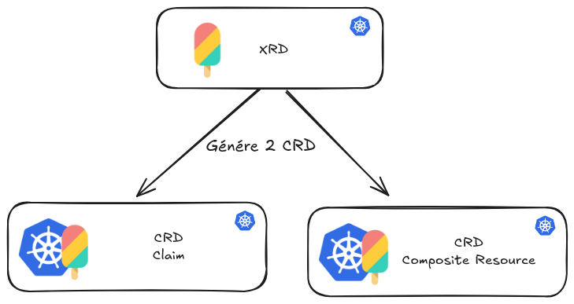
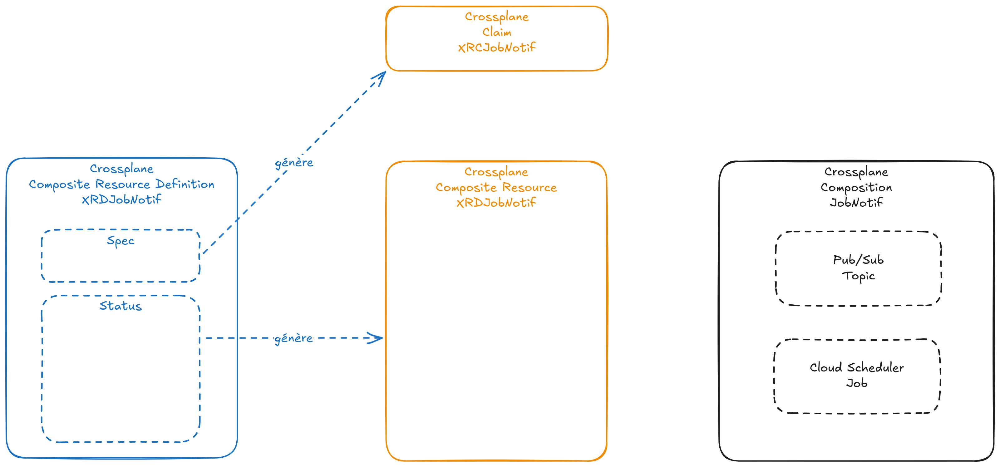
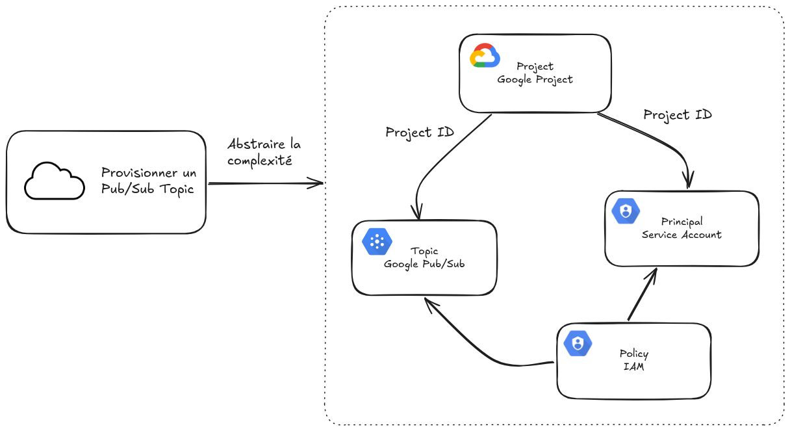
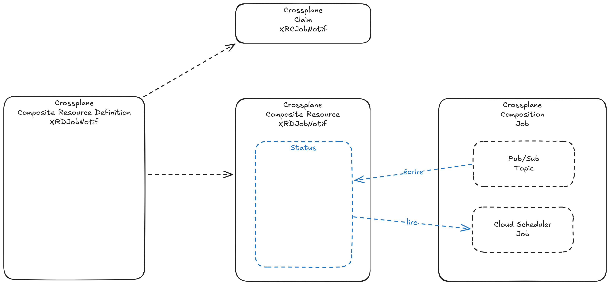
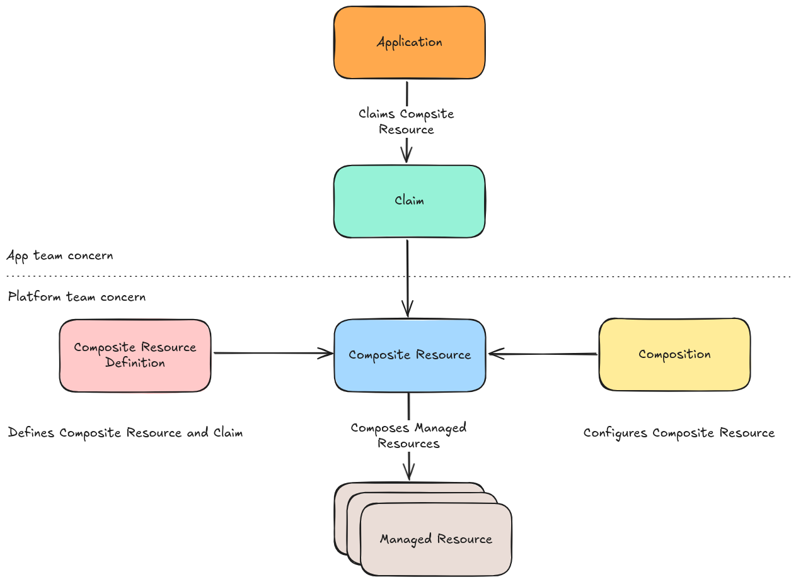

Crossplane est une extension open-source à Kubernetes qui permet aux équipes plateforme d'assembler l'infrastructure provenant de plusieurs cloud providers, et d'exposer des APIs de plus haut niveau pour que les équipes d'applicatives puissent les consommer.

<!-- truncate -->


Crossplane se définit comme annoncé sur leur baseline :

> Build control planes without needing to write code. Crossplane has a highly extensible backend that enables you to orchestrate applications and infrastructure no matter where they run, and a highly configurable frontend that lets you define the declarative API it offers.

...comme un orchestrateur de ressources multi-cloud.

## Introduction

Crossplane permet de définir des ressources de manière déclarative, et de les provisionner sur des clouds publics (AWS, Azure, GCP, etc.) ou privés (VMware, OpenStack, etc.).

Membre de la CNCF depuis 2020, ils ont rejoint le programme d'incubation (incubating) en 2021, dans la catégorie "Scheduling & Orchestration" ce qui en fait un projet prometteur, puisque synonyme de stabilité et d'utilisation en production.
Membre du programme *Incubation* de la CNCF depuis 2021, Crossplane est considéré comme un projet sérieux, prometteur et ambitieux par les SIG/TOC de la CNCF.


Crossplane se rapproche du mode de fonctionnement de Terraform et apporte des fonctionnalités supplémentaires qui le font se démarquer :

* Définition de ressources de manière déclarative
* Réconciliation sur base du pattern des Kubernetes Operators

Crossplane est un projet open-source, disponible sur [GitHub](https://github.com/crossplane/crossplane) sous licence Apache 2.0 et majoritairement développé par la société [Upbound](https://upbound.io/).

## Intérêt

Crossplane se démarque de ses concurrents par sa capacité à gérer des ressources et appliquer les modifications en temps réel. Le pattern de réconciliation lui permet d'être réactif et d'appliquer les changements sur les ressources distantes en temps réel, qui est une vue de l'esprit étant donné que la réconciliation est une boucle qui s'exécute à intervalles réguliers.

## Architecture

Crossplane s'architecture autour de plusieurs concepts :

* Manipuler les ressources Cloud
* Orchestrer et ordonner la création des ressources
* Provisionner une architecture complexe
* Proposer un objet simple à manipuler

## Concepts

### Provider

Le Provider est le composant en charge de la gestion des ressources Cloud. Il est responsable de la communication avec l'API du Cloud Provider, de la gestion du cycle de vie des ressources.



Les providers sont labelisés **Official** (développés par Upbound) ou **Community** (développés par la communauté).

Chaque Provider s'installe avec des CRDs spécifiques qui définissent les ressources gérées par le Provider. Ces CRDs permettent de décrire l'objet distant à créer, mettre à jour ou supprimer.

Exemple avec le Provider Google Cloud Pub/Sub.

```yaml
apiVersion: pkg.crossplane.io/v1
kind: Provider
metadata:
  name: provider-gcp-pubsub
spec:
  package: xpkg.upbound.io/upbound/provider-gcp-pubsub:v1.8.3
```

Le Provider accède au Cloud Provider dès lors qu'il est configuré avec les informations d'authentification (clé API, token, etc.) au travers de l'objet `ProviderConfig`.

```yaml
apiVersion: gcp.upbound.io/v1beta1
kind: ProviderConfig
metadata:
  name: default
spec:
  credentials:
    source: Secret
    secretRef:
      namespace: upbound-system
      name: provider-creds # Nom du secret qui contient les credentials
      key: creds # Nom de l'attribut du secret qui contient les credentials
  projectID: zatsit-crossplane-demo
```

### Catalogue des Providers

L'ensemble des Providers publiques sont disponibles sur la [Upbound Marketplace](https://marketplace.upbound.io/).

Pour les Providers complexes, on retoruve le découpage par ressource sous la forme de Provider Family.

On retrouve donc des Providers pour les ressources EC2, S3, RDS, etc. pour AWS, et de manière similaire pour les autres Cloud Providers. Tous ces Providers sont regroupés dans une Provider Familiy qui contrôle la configuration des Providers du Cloud Provider.

Prenons exemple du provider [Google Cloud](https://marketplace.upbound.io/providers/upbound/provider-family-gcp/v1.8.3), on retrouve la hiérarchie suivante :

* Provider Family `provider-family-gcp`
* Provider Config `ProviderConfig` lié à au Provider Family
* Providers: `provider-gcp-compute`, `provider-gcp-container`, `provider-gcp-appengine`, etc

> Dans l'histoire de Crossplane, les Providers historiques de AWS, Google Cloud et Azure étaient composés d'un seul agent responsable de la gestion de toutes les ressources du Cloud Provider. Face à l'installation d'un nombre massif de CRDs dans le cluster Kubernetes, les développeurs ont décidé de découper les Providers en plusieurs sous-Providers, un par ressource, ce qui réduit drastiquement le nombre de CRDs installés et améliore le ratio CRD-utilisés / CRDs-installés.

### Managed Resource (MR)

Le Managed Resource est l'objet qui représente la ressource distante à gérer. Il est défini par le Provider et est utilisé pour décrire la ressource à créer, mettre à jour ou supprimer.

Ce sont des objets Kubernetes qui sont créés dans le cluster Kubernetes et qui sont gérés par le Provider.

Exemple avec la ressource [`Topic`](https://marketplace.upbound.io/providers/upbound/provider-gcp-pubsub/v1.8.3/resources/pubsub.gcp.upbound.io/Topic/v1beta1) du Provider [Google Cloud Pub/Sub](https://marketplace.upbound.io/providers/upbound/provider-gcp-pubsub/v1.8.3).

```yaml
apiVersion: pubsub.gcp.upbound.io/v1beta1
kind: Topic
metadata:
  annotations:
    meta.upbound.io/example-id: pubsub/v1beta1/topic
  labels:
    testing.upbound.io/example-name: topic
  name: topic
spec:
  forProvider: {}
```

Ce simple manifeste suffit amplement pour créer un Topic dans Google Cloud Pub/Sub du même nom que le nom du manifest (défini dans `metadata.name`).

On distingue deux types de Managed Resources :

* Les Managed Resources de type Crossplane : gérés par les providers du Cloud Provider.
* Les Managed Resources de type Kubernetes : gérés par un autre contrôleur Kubernetes, externe à Crossplane.



Les deux types de Managed Resources possèdent leur avantages et inconvénients. On détaillera cela dans un prochain article.

### Composition

La Composition est un objet qui permet de définir un ensemble d'objets qui cohabitent ensemble dans le but de créer une architecture complexe.

La Composition est un objet Kubernetes qui est géré par Crossplane et qui est responsable de la création, mise à jour et suppression des objets qui le composent. Il est la pierre angulaire car c'est l'élément qui donne toute sa puissance en orchestrant les ressources.

Exemple avec une Composition qui crée les éléments suivants :

* Un Topic dans Google Cloud Pub/Sub
* Un Job dans Cloud Scheduler


```yaml
---
apiVersion: apiextensions.crossplane.io/v1
kind: Composition
metadata:
  name: job-notif
spec:
  compositeTypeRef:
    apiVersion: blog.zatsit.fr/v1alpha1
    kind: XJobNotif
  mode: Resources
  resources:
    - name: Topic
      base:
        apiVersion: pubsub.gcp.upbound.io/v1beta1
        kind: Topic
        metadata:
          annotations:
            meta.upbound.io/example-id: pubsub/v1beta1/topic
          labels:
            testing.upbound.io/example-name: topic
          name: dynamically-set
        spec:
          forProvider: {}
      patches:
        - type: FromCompositeFieldPath
          fromFieldPath: spec.name
          toFieldPath: metadata.name
            
    - name: Job
      base:
        apiVersion: cloudscheduler.gcp.upbound.io/v1beta1
        kind: Job
        metadata:
          annotations:
            meta.upbound.io/example-id: cloudscheduler/v1beta1/job
          labels:
            testing.upbound.io/example-name: job
          name: job
        spec:
          forProvider:
            description: Test job
            httpTarget:
              - body: dGVzdAo=
                httpMethod: POST
                uri: https://postman-echo.com/post
            region: us-central1
            schedule: "1 * * * *"
      patches:
        - type: FromCompositeFieldPath
          fromFieldPath: spec.name
          toFieldPath: metadata.name
```

### Composite Resource Definition (XRD)

La Composite Resource Definition (XRD) est un objet plus haut niveau qui a pour but de définir l'architecture interne de notre Composition en définissant 2 objets :

* La Composite Resource (XR) : l'objet instancié qui définira le cycle de vie de notre objet complexe
* Le Composite Resource Claim (XRC) : l'objet qui sera manipulé par l'utilisateur final et qui se veut simple



La XRD est un objet complexe en apparence qui est juste très structuré. Il comporte de façon très pragmatique 2 grandes sections :

* `claim` et `spec` : qui définit la dénomination et la structure du Claim sous forme d'une CRD
* `status` : qui définit la structure du XR lors de son instanciation



La XRD définit à la fois la XRC et la XR afin de garantir une cohérence entre les deux objets manipulés. La XR n'a de sens que si les valeurs manipulées sont bien définit par les paramètres utilisateur.

En résumé, notre XRD est une CRD qui définit 2 autres CRDs : la XRC et la XR.

Voici un exemple de XRD pour notre Composition `JobNotif` :

```yaml
---
apiVersion: apiextensions.crossplane.io/v1
kind: CompositeResourceDefinition
metadata:
  name: xjobnotifs.blog.zatsit.fr
spec:
  group: blog.zatsit.fr
  names:
    plural: xjobnotifs
    kind: XJobNotif
  claimNames:
    kind: JobNotif
    plural: jobnotifs
  versions:
    - name: v1alpha1
      referenceable: true
      served: true
      schema:
        openAPIV3Schema:
          properties:
            spec:
              type: object
              properties:
                name:
                  type: string
                  description: Name of the JobNotif
            status:
              properties: {}
              type: object
          type: object
```

### Composite Resource Claim (XRC)

La Composite Resource Claim (XRC) est l'objet qui est manipulé par l'utilisateur. Il a pour objectif d'être simmple et d'abstraire toute complexité liée à l'architecture en dessous.

Par exemple, pour notre Composition `JobNotif`, l'utilisateur final n'a pas besoin de connaître les sous-ressources créées en dessous, telle que le Service Account (SA) et ses credentials, la gestion des policies liées au SA ainsi que le stockage des valuers sensibles dans le Secret Manager. Toute cette complexité doit être masquée pour ne fournir à l'utilisateur la seule véritable information utile : le nom du Topic.



Voici un exemple de XRC pour notre Composition `JobNotif` :

```yaml
apiVersion: blog.zatsit.fr/v1alpha1
kind: JobNotif
metadata:
  name: jobnotif-sample
spec:
  name: my-jobnotif
```

### Composite Resource (XR)



## Approche Plateforme

Crossplane se veut dichotomique en proposant une approche plateforme en distinguant 2 personas :

* Le développeur de la plateforme : qui consomme les ressources mises à disposition
* L'ingénieur plateforme : qui compose les ressources et les expose aux développeurs


Toute la complexité réside dans la définition du contrat de service entre les deux personas ainsi que la gestion des ressources sous-jacentes.

Une fois le contrat clair, le développeur écrit le manifest (XRC) qui décrit le besoin fondamental.



## Conclusion

Crossplane est un outil qui permet d'abstraire la complexité des ressources Cloud et de les manipuler de manière déclarative.

Cette rapide introduction à Crossplane vous permet de comprendre les concepts de base et les forces de la solution. Dans un prochain article, nous entrerons plus en détail sur l'utilisation de Crossplane avec des objets plus complexes et des cas d'utilisation plus avancés.

## Liens utiles

* Site officiel de Crossplane : [crossplane.io](https://crossplane.io/)
* GitHub Crossplane : [github.com/crossplane/crossplane](https://github.com/crossplane/crossplane)
* CNCF Crossplane : [cncf.io/projects/crossplane](https://www.cncf.io/projects/crossplane/)
