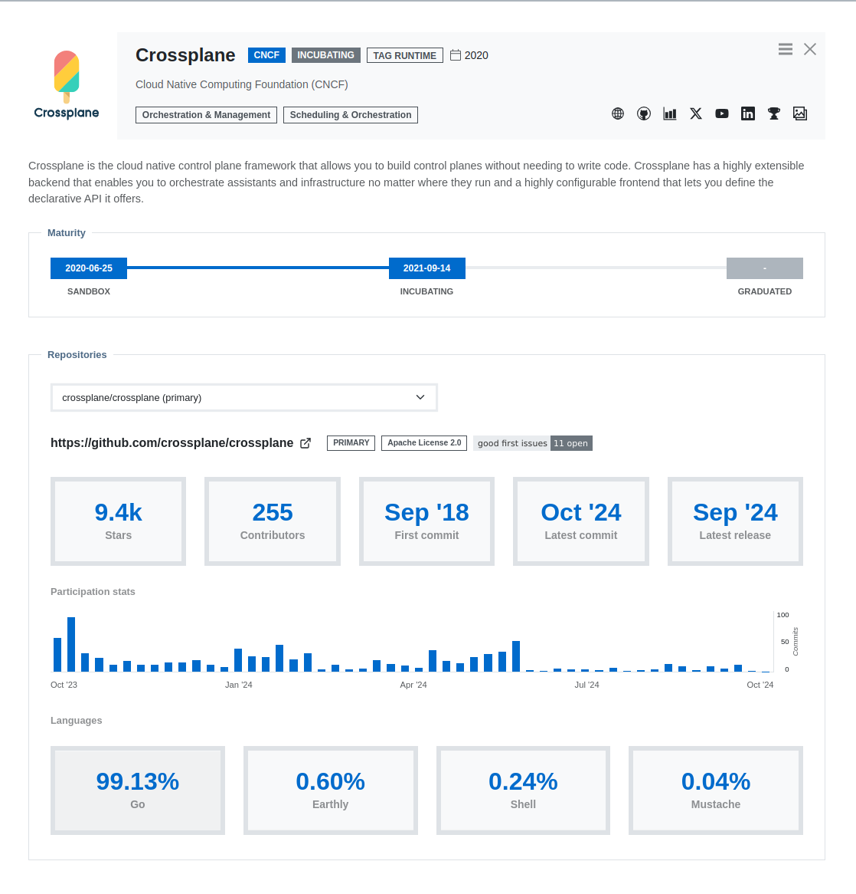
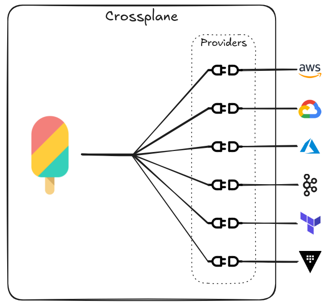

Crossplane apporte une stratégie multi-cloud.

<!-- truncate -->

{ width=100px }

Crossplane se défini comme annoncé sur leur baseline...

> Build control planes without needing to write code. Crossplane has a highly extensible backend that enables you to orchestrate applications and infrastructure no matter where they run, and a highly configurable frontend that lets you define the declarative API it offers.

...comme un orchestrateur de ressources multi-cloud.

## Introduction

Crossplane permet de définir des ressources de manière déclarative, et de les provisionner sur des clouds publics (AWS, Azure, GCP, etc.) ou privés (VMware, OpenStack, etc.).

Membre de la CNCF depuis 2020, ils ont rejoint le programme d'incubation (incubating) en 2021, ce qui en fait un projet prometteur.
Membre du programme *Incubation* de la CNCF depuis 2021, Crossplane est considéré comme un projet sérieux, prometteur et ambitieux par les SIG/TOC de la CNCF.

{ width=100px }

Crossplane se rapproche du mode de fonctionnement de Terraform et apporte des fonctionnalités supplémentaires qui le font se démarquer :

* Définition de ressources de manière déclarative
* Réconciliation sur base du pattern des Kubernetes Operators

Crossplane est un projet open-source, disponible sur [GitHub]() sous licence Apache 2.0 et majoritairement développé par la société [Upbound](https://upbound.io/).

## Intérêt

Crossplane se démarque de ses concurrents par sa capacité à gérer des ressources et appliquer les modifications en temps réel. Le pattern de réconciliation lui permet d'être réactif et d'appliquer les changements sur les ressources distantes en temps réel, qui est une vue de l'esprit étant donné que la réconciliation est une boucle qui s'exécute à intervalles réguliers.

## Architecture

Crossplane s'architecture autour de plusieurs concepts :

* Manipuler les ressources Cloud
* Orchestrer et ordonner la création des ressources
* Provisionner une architecture complexe sur base d'un objet simple

## Concepts

### Provider

Le Provider est le composant en charge de la gestion des ressources Cloud. Il est responsable de la communication avec l'API du Cloud Provider, de la gestion du cycle de vie des ressources.

{ width=100px }

Les providers sont labelisés **Official** (dévloppé par Upbound) ou **Community** (développé par la communauté).

Chaque Provider s'installe avec des CRDs spécifiques qui définissent les ressources gérées par le Provider. Ces CRDs permettent de décrire l'objet distant à créer, mettre à jour ou supprimer.

> Dans l'histoire de Crossplane, les Providers historiques de AWS, Google Cloud et Azure étaient composés d'un seul agent responsable de la gestion de toutes les ressources du Cloud Provider. Face à l'installation d'un nombre massif de CRDs dans le cluster Kubernetes, les développeurs ont décidé de découper les Providers en plusieurs sous-Providers, un par ressource.
>
> On retrouve donc des Providers pour les ressources EC2, S3, RDS, etc. pour AWS, et de manière similaire pour les autres Cloud Providers. Tous ces Providers sont regroupés dans une Provider Familiy qui contrôle la configuration des Providers du Cloud Provider.

Exemple avec le Provider Google Cloud Pub/Sub.

```yaml
apiVersion: pkg.crossplane.io/v1
kind: Provider
metadata:
  name: provider-gcp-pubsub
spec:
  package: xpkg.upbound.io/upbound/provider-gcp-pubsub:v1.8.3
```

Le Provider accède au Cloud Provider dès lors qu'il est configuré avec les informations d'authentification (clé API, token, etc.) au travers de l'objet `ProviderConfig`.

```yaml
apiVersion: gcp.upbound.io/v1beta1
kind: ProviderConfig
metadata:
  name: default
spec:
  credentials:
    source: Secret
    secretRef:
      namespace: upbound-system
      name: provider-creds # Nom du secret qui contient les credentials
      key: creds # Nom de l'attribut du secret qui contient les credentials
  projectID: zatsit-crossplane-demo
```

### Catalogue des Providers

L'ensemble des Providers publiques sont disponibles sur la [Upbound Marketplace](https://marketplace.upbound.io/).

### Managed Resource

### Composition

### Composite Resource Definition

### Claim

### Composite Resource

## Utilisation

## Retours d'expérience

https://excalidraw.com/#room=93228e29c15bbdab68fd,RGuw0GLa_0acvGN-o3q1yg

## Liens utiles

* Site officiel de Crossplane : [crossplane.io](https://crossplane.io/)
* GitHub Crossplane : [github.com/crossplane/crossplane](https://github.com/crossplane/crossplane)
* CNCF Crossplane : [cncf.io/projects/crossplane](https://www.cncf.io/projects/crossplane/)
