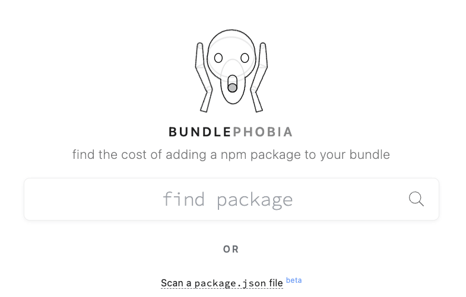
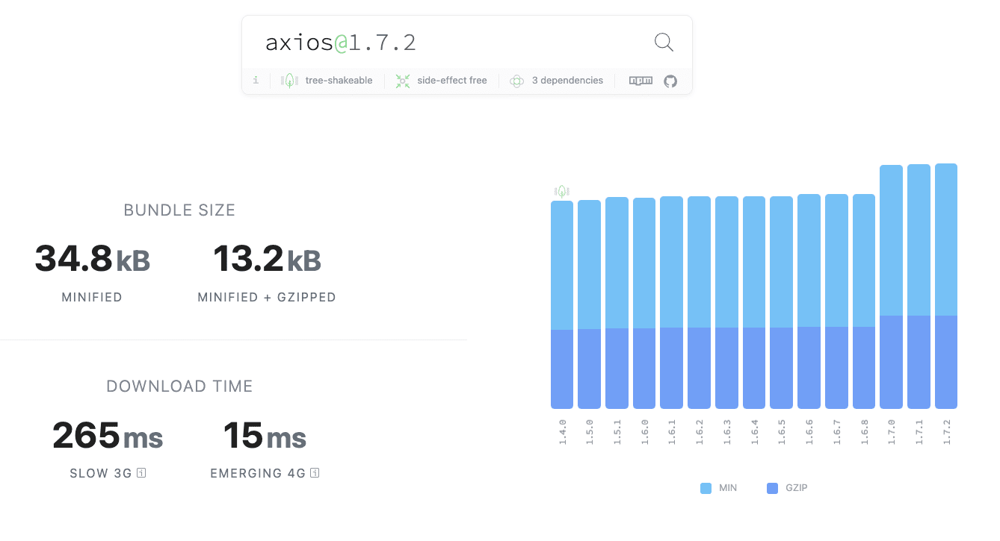

# Faites maigrir votre JavaScript avec Bundlephobia

Dans l’écosystème JavaScript, rien de plus facile que d’ajouter une nouvelle librairie à son projet, qu’il soit front-end ou back-end. NPM est là pour nous aider, un simple “npm install @theultimatelib” et hop, le tour est joué.

Mais dans une démarche d’éco-conception et de performance, comment savoir si la librairie que l’on vient d’installer est la meilleure ? ou la plus adaptée ? a-t-elle un impact sur le poids de mon application ?

<!-- truncate -->

Pour avoir plus d’information sur les librairies JavaScript que vous utilisez, un petit outil en ligne vous permet d’analyser leur impact sur le poids de votre application, mais également pour les applications front-end, l’impact sur le temps de chargement. 

Cet outil, c'est BUNDLEPHOBIA ! ([https://bundlephobia.com/](https://bundlephobia.com/))

Voici un petit exemple de ce que propose “bundlephobia” pour la librairie Axios, libraire bien connue des développeurs front-end et back-end (Node.js) qui permet d’effectuer des appels HTTP.

On retrouve plusieurs informations sur la librairie :

- sa dernière version, ici la 1.7.2
- savoir si la librairie utilise le “tree-shaking” ou non (ce qui permet une réduction du bundle générer si on n'utilise pas toutes les fonctions de la librairie)
- si la librairie est sensible aux interférences avec d’autres librairies tierces
- le nombre de dépendances qu’elle possède, ici 3 dépendances
- le poids de la librairie minifiée ou minifiée et compressée
- le temps de chargement de cette librairie en slow 3G et 4G (ce temps peut être réduit avec l’utilisation du “tree-shaking”)
- l’évolution du poids de la librairie au fil des versions
- la composition de la libraire (si le code est majoritairement interne à la librairie ou provient des dépendances), ici 99,8% du code est du code source de la librairie.

Petit bonus, “Bundlephobia” propose des alternatives à l’utilisation de la librairie, avec l’impact sur le poids du bundle. Ici, “Bundlephobia” propose “Phin” comme alternative qui est aussi un client HTTP pour Node.js. Ce dernier est 66% plus léger, mais attention, il ne propose peut-être pas toutes les fonctionnalités d’Axios, il vous revient le choix de tester ou non. Vous pouvez également proposer d’autres librairies alternatives à Axios et venir enrichir la base de donnée de “Bundlephobia” et contribuer à son développement.

À vous maintenant, de tester vos package.json pour tenter de réduire la taille de vos applications front-end pour plus de performance et vos applications Node.js pour améliorer leur empreinte carbone.

