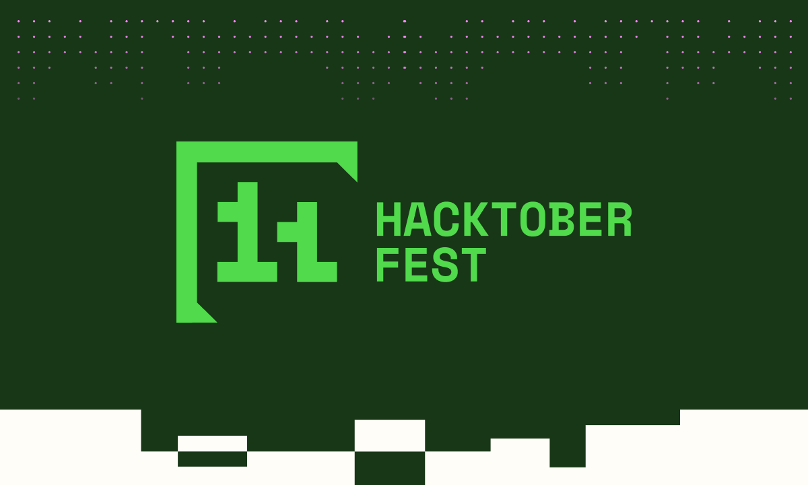
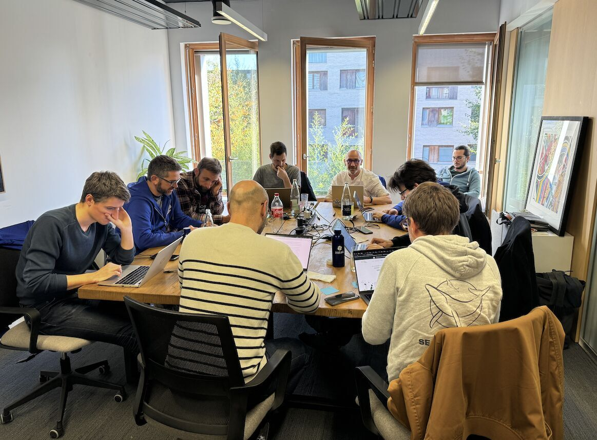

Le mois d'octobre est LE mois de l'année pour tous les amoureux de l'open source, c'est le mois du [**Hacktoberfest**](https://hacktoberfest.com/) !
La communauté open source a besoin d'aide (d'idées, de compétences, de temps) pour faire avancer ses projets.

Il était donc évident pour nous de participer activement à cet événement, en contribuant sur des projets qui nous tiennent à cœur, ou que nous utilisons au quotidien.

<!-- truncate -->

## Faut-il rappeler ce qu'est l'open source ?

L'open source est un modèle de développement qui repose sur la collaboration et le partage. 
Les projets open source sont accessibles à tous, permettant à chacun de consulter, modifier et/ou partager le code.

Le mouvement open source est animé par une communauté mondiale de développeurs (mais pas que...) qui donnent de leur temps pour faire évoluer les projets. 
Le code est hébergé sur une multitude de plateformes, dont les plus connues sont GitHub et GitLab.

## Qu'est-ce que le Hacktoberfest ?

Le [**Hacktoberfest**](https://hacktoberfest.com/) est un événement annuel qui se déroule tout au long du mois d'octobre. 
Il a pour objectif d'encourager les contributions à des projets open source en récompensant les participants qui réalisent des **pull requests**/**merge requests** sur des dépôts publics.

L'année 2024 sonne la 11ème édition du Hacktoberfest, événement sponsorisé par [DigitalOcean, Cloudflare et Quira](https://hacktoberfest.com/about/), et pour lequel l'engouement ne cesse de croître. 
C'est l'occasion pour des milliers de développeurs, étudiants, passionnés et/ou curieux de rejoindre la communauté open source, d'apprendre, de partager, voire de s'amuser.

## Nos contributions au Hacktoberfest 2024

Nous avons mis le collectif à contribution sur tout le mois d'octobre, pendant nos midis à l'agence pour certains, et lors de [notre zatsday d'Octobre](https://www.linkedin.com/posts/zatsit_prs-gouvernance-zatsday-activity-7255604241640173569-4-cJ?utm_source=share&utm_medium=member_desktop), pour contribuer à des projets open source.

### Consul Democracy - Amélioration de l'interface utilisateur

* Projet : [Consul Democracy](https://github.com/consuldemocracy/consuldemocracy)
* Description : Consul Democracy est une plateforme de participation citoyenne. (*Consul Democracy - Open Government and E-Participation Web Software*)
* Contributeur : [Nicolas FOURRE](https://github.com/nfourre)
* Pull Request : [Fill in space in social buttons when options are turned off](https://github.com/consuldemocracy/consuldemocracy/pull/5757)

### Impact Framework - Amélioration de la documentation

* Projet : [Impact Framework - Documentation](https://github.com/Green-Software-Foundation/if-docs)
* Description : Documentation pour le projet Impact Framework de la Green Software Foundation. (*Documentation website for the Impact Framework project*)
* Contributeur : [Quentin BURG](https://github.com/quentin-burg)
* Pull Request : [Fix example in quick-start.md](https://github.com/Green-Software-Foundation/if-docs/pull/117)

### AsyncAPI - Amélioration de l'experience utilisateur

* Projet : [AsyncAPI - Website](https://github.com/asyncapi/website)
* Description : Site web de AsyncAPI (*AsyncAPI specification website*)
* Contributeur : [Guillaume GAYOT](https://github.com/GuillaumeGayot)
* Pull Request : [fix(migrating-to-v3): fix mark down to ensure correct highlighting](https://github.com/asyncapi/website/pull/3268)

### Cocogitto - Gestion des identifiants utilisateur dans la Github Action

* Projet : [Cocogitto - Github Action](https://github.com/cocogitto/cocogitto-action)
* Description : Github Action pour vérifier la compliance au conventional commit. (*A github action to ensure your current gitlog respect the conventional commit specification*)
* Contributeur : [Guillaume GAYOT](https://github.com/sergejomon)
* Pull Request : [Feat/add input for profile](https://github.com/cocogitto/cocogitto-action/pull/31)

### Crossplane Assistant - Création de la documentation du projet

* Projet : [Crossplane Assistant - Documentation](https://github.com/crossplane-assistant/readthedocs)
* Description : Documentation du projet Crossplane Assistant (*Crossplane Assistant documentation website*)
* Contributeur : [Germain LEFEBVRE](https://github.com/germainlefebvre4)
* Pull Request : [feat: First structure](https://github.com/crossplane-assistant/readthedocs/pull/1)

### Mocked API - Ajout d'une nouvelle fonctionnalité

* Projet : [Mocked API - Github](https://github.com/ageddesi/Mocked-API)
* Description : Ajout d'une fonctionnalité sur l'envoi de mail
* Contributeur : [Guillaume GAYOT](https://github.com/sergejomon)
* Pull Request : [feat(emails): add endpoint for random email using user names #368](https://github.com/ageddesi/Mocked-API/pull/368)

##  Pourquoi promouvoir l’open source ?

Chez **zatsit**, nous croyons fermement que l’open source est un véritable tremplin pour l’innovation et la démocratisation des technologies, de la simple librairie de développement jusqu'à la gestion complète d'un CRM. 

En participant au Hacktoberfest, nous promouvons cette culture de partage et de collaboration. 
Pour nous, chaque contribution est importante, qu’elle soit technique ou non, et permet de faire avancer les projets.

Voici quelques raisons pour lesquelles nous encourageons l’open source :

* **Accessibilité** : Le code source est public et permet à toute personne/développeur, quelle que soit sa localisation, d'y accéder, d’apprendre, d’utiliser, de partager et d'y contribuer.
* **Innovation** : La communauté open source regorgent de talents, et c'est tous ensemble que les projets les plus innovants peuvent voir le jour. L'exposition des projet au grand public permet de diffuser le savoir des plus innovants et partager cette connaissance.
* **Transparence et sécurité** : Le code source est publique donc la transparence est totale, ce qui permet à la communauté d’auditer, d’identifier et de corriger les failles de sécurité plus efficacement.
* **Indépendance technologique** : L’open source permet aux entreprises et aux utilisateurs de ne pas dépendre d'un provider en particulier et ainsi adapter les outils selon leurs besoins.
* **Gratuité** : La plupart des projets open source sont gratuits, ce qui permet à tous d’y accéder, de les utiliser voir de les modifier (fork).

### Remerciements à la communauté open source

Le Hacktoberfest est un moment privilégié pour remercier toutes les personnes qui font vivre cette communauté.
Que vous soyez développeur, traducteur, testeur ou simple utilisateur, votre contribution est précieuse. 
C'est grâce à vous que des projets d’envergure internationale voient le jour, évoluent, et restent accessibles à tous.

Nous remercions tous les contributeurs de **zatsit**. 
Ce mois d'octobre a permis de mettre en lumière nos efforts sur la partie open source. 
Mais cet engagement ne s'arrête pas au mois d'octobre, il est permanent et nous continuons de contribuer au sein de la communauté tout au long de l'année.

### Rejoignez-nous pour le prochain Hacktoberfest

Le Hacktoberfest est une aventure collective ouverte à tous, des débutants aux experts. 
Si vous souhaitez vous lancer ou approfondir vos compétences, [rejoignez-nous](https://www.zatsit.fr/collaborer-avec-zatsit/) ! 
Chaque contribution, même minime, aide à faire avancer la technologie. 

Ensemble, continuons à construire de meilleurs outils, plus justes et plus accessibles.

<!-- blog post end -->

Vous avez aimé ce post ? Partagez le !

