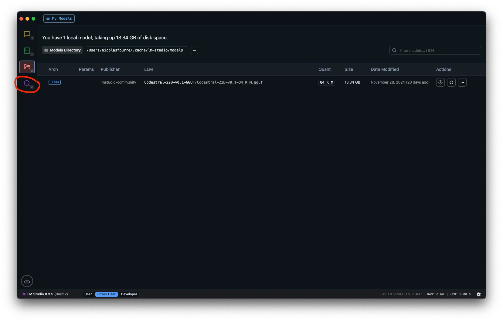
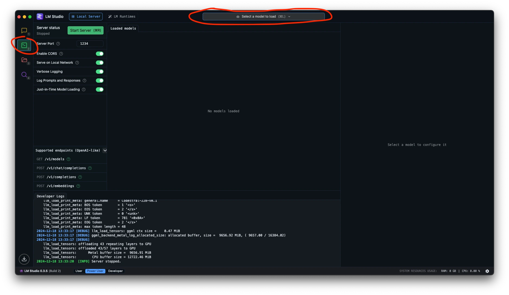
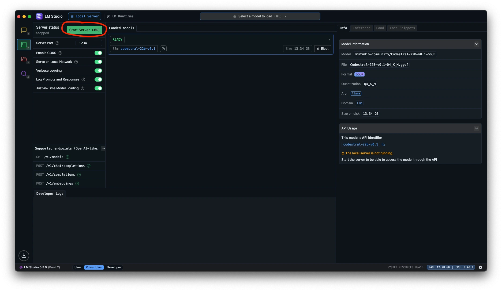
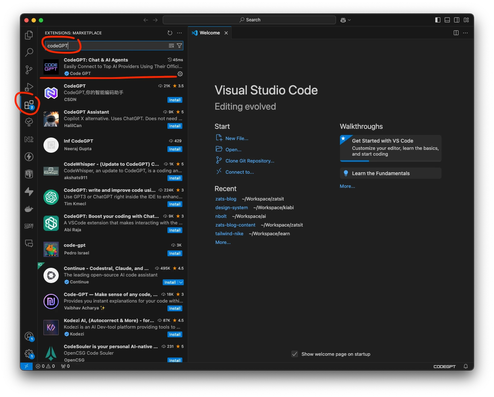
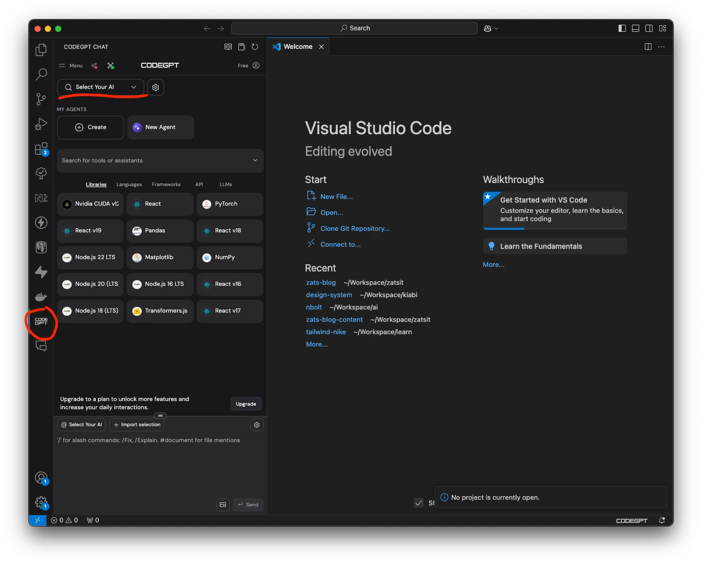
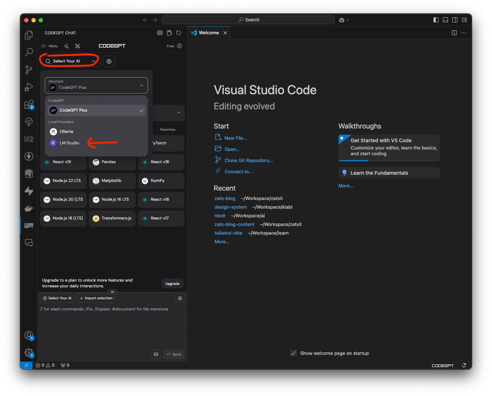
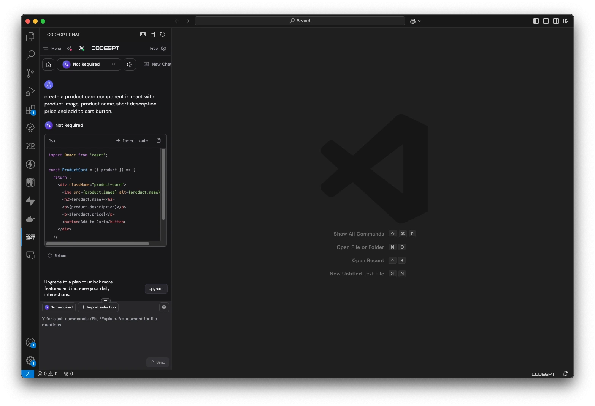

# Utiliser votre assistant IA en local (et sur VSCode) pour mieux respecter la planête.

Vous rêvez d'un assistant intelligent comme GitHub Copilot, mais moins couteux en ressources machine, et gratuit ? Vous êtes au bon endroit.

<!-- truncate -->

Dans cet article, nous allons vous guider, étape par étape, pour créer votre propre assistant IA local et le déployer dans votre environnement de développement (VSCode ici); à l’aide de [LM Studio](https://lmstudio.ai/) et de l’extension [CodeGPT](https://docs.codegpt.co/docs/tutorial-basics/installation).

# Disclaimer

Vous le savez sans doute, l'utiliation d modèles d'IA nécessitent beaucoup de ressources machine : un processeur performant, une carte graphique puissante (GPU) et une grande quantité de RAM sont généralement recommandés (LM Studio permet de choisir l’utilisation du CPU et/ou GPU, au passage).

# Prérequis

Avant de commencer, assurez-vous d’avoir NodeJS d’installé en version 18+ et Visual Studio Code (VSCode).

# Installation de LM Studio

👉 Allez sur le site de [LM Studio] ([https://lmstudio.ai/download](https://lmstudio.ai/download)) et téléchargez la version adaptée à votre matériel.

👉 Une fois installée, il est temps de choisir le modèle le plus adapté à votre besoin.
Nous vous proposons de tester le nouveau modèle de Mistral AI : [Codestral](https://mistral.ai/fr/news/codestral/), un modèle qui supporte plus de 80 langages de programmation. 
Il existe des modèles alternatifs pour des assistants de code comme [Code llama](https://codellama.dev/about) ou [StarCoder](https://github.com/bigcode-project/starcoder) si vous souhaitez comparer.

👉 Ouvrez **LM Studio** et sélectionnez la loupe (dans le menu de gauche) afin de rechercher le modèle **Codestral** via la barre de recherche :




👉 Une fois le modèle trouvé, cliquez sur le bouton **Use in New Chat** pour télécharger le modèle.

*Patientez quelques instants, le temps de télécharger le modèle qui pèse un peu plus de 13 GB.*

👉 Une fois téléchargé, accédez au menu **Developer** (icône **Terminal** sur la sidebar de gauche), puis sélectionnez le modèle à charger dans la barre du haut :



👉 Chargez le modèle **Codestral** que vous venez de télécharger. 
Patienter quelques instants, le modèle se charge en mémoire. Une fois le chargement terminé, il ne vous reste plus qu’à cliquer sur **Start Server** pour commencer à utiliser votre assistant.



La configuration de **LM Studio** est maintenant terminée. Voyons comment effectuer son intégration dans **VS Code**.

# Intégration dans Visual Studio Code

👉 La première chose à faire est de télécharger l’extension [CodeGPT](https://docs.codegpt.co/docs/tutorial-basics/installation) qui permet, en s’inscrivant sur leur site, d’accéder aux APIs de différentes IAs comme **ChatGPT** ou encore **ClaudeAI**.
Toutefois, ce n’est pas ce que l’on souhaite faire ici.

Nous cherchons à utiliser l'infrastructure de nos machines, plutôt que celles de serveurs distants, souvent alimentés avec une énergie à la provenance inconnue et dans un datacenter sûrement pas tout proche.

Une belle façon d’être un peu plus **green** et de réduire notre empreinte.



👉 Une fois l’extension installée, cliquez sur l’icône **ChatGPT** dans la *sidebar* de gauche, puis sélectionnez l’assistant à utiliser.



👉À la place de **CodeGPT Plus** (qui vous incite à utiliser les API des GAFAM de l’IA), choisissez **LM Studio** comme **Provider Local**.



Et voilà ! Le tour est joué.

Vous avez à présent un assistant d’aide à la programmation, qui utilise directement vos ressources locales pour fonctionner.

Qui vous a dit qu'il n'était pas possible de faire de l'IA frugale ?

# Utiliser votre nouvel assistant

Pour vérifier que l’assistant fonctionne bien, nous allons lui demander de créer un composant *Product Card* en ReactJS avec une image, un nom du produit, une courte description, un prix et un bouton d’ajout au panier, en interagissant directement avec la fenêtre de chat via le prompt suivant :

```
Create a product card component in react with product image, product name, short description, price and add to cart button
```

*Attention, les prompts sont à rédiger en anglais. Votre assistant ne fait pas encore la traduction automatique*



Une fois le prompt envoyé, l’IA générative utilise le modèle **Codestral**  de votre **LM Studio** pour répondre.

Si vous vérifiez la fenêtre de votre LM Studio, vous verrez bien le prompt et la réponse dans les logs.

# Conclusion

Le code généré par l’assistant n’est peut-être pas encore au niveau de ce que peut produire [Bolt.new](http://Bolt.new) de StackBlitz ou [v0.dev](http://v0.dev) de Vercel, mais c’est déjà une première approche d’utilisation de l’IA beaucoup plus responsable (et économique).

Cet assistant se révèle toutefois plus efficace que ses alternatives, pour générer des tests unitaires à partir de votre code ou pour optimiser ce dernier.

Maintenant, c'est à vous de faire le reste : 
- explorer les possibilités que vous offrent cet assistant 
- tester d’autres modèles d’IA (en local) plus adaptés à vos besoins. 
- en parler autour de vous, pour favoriser l'adoption de cette technique.