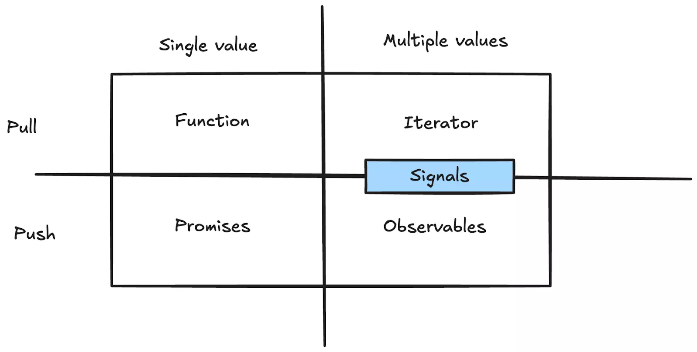
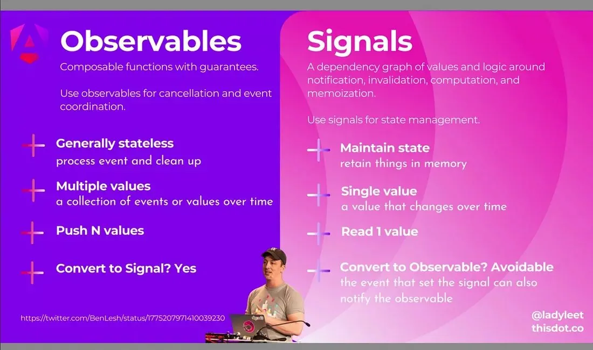
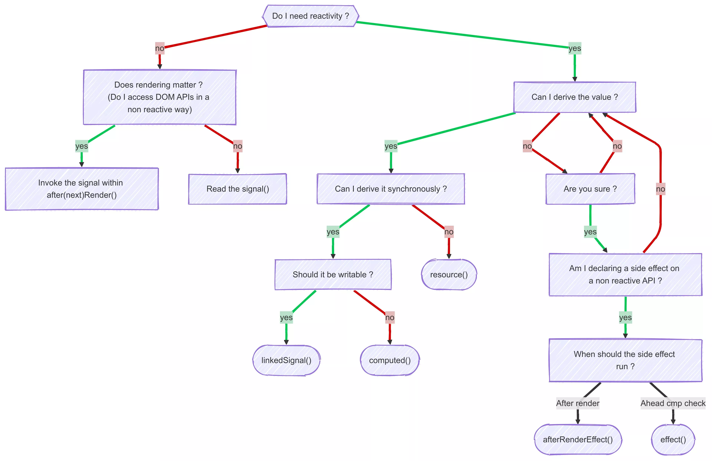
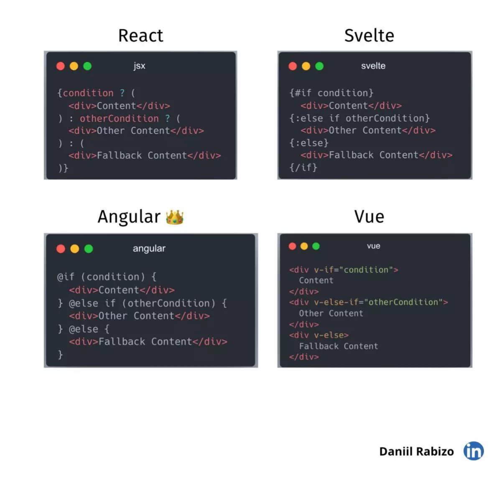
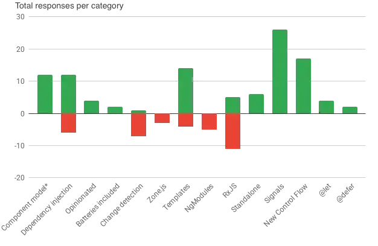
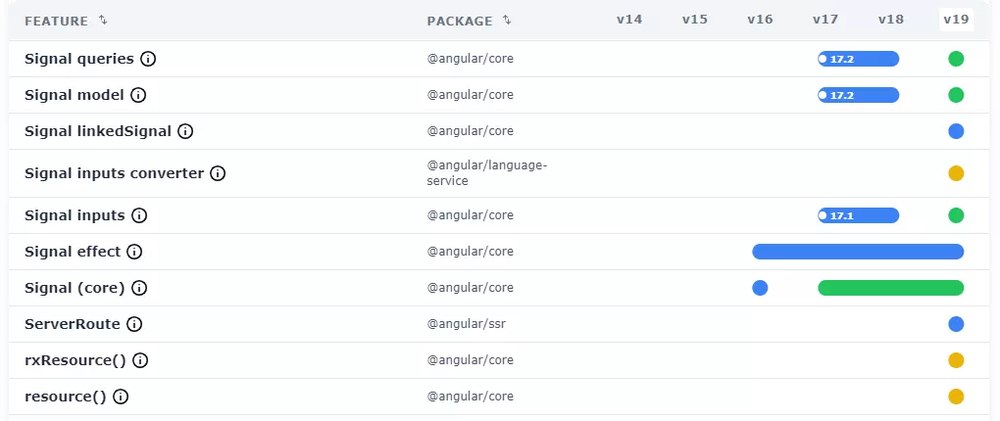

[](https://x.com/DanielGlejzner/status/1862568911482626328/photo/1)

Cet article à propos d'Angular, a pour but de donner un aperçu de la dynamique d'évolution du Framework ces derniers temps, et la direction prise par l'équipe de développement.
<!-- truncate -->
En effet, avec des avancées majeures dans les dernières versions via le lancement des composants standalone en expérimental en V14, l'arrivée des Signals en V16 ou encore la nouvelle syntaxe de control flow en v17, Angular progresse bien dans ses objectifs d'améliorer les performances, l'expérience des développeurs, la stabilité et la fiabilité (voir la [vidéo "State of Angular" par Minko Gechev, Google Core Team](https://www.youtube.com/live/C9fiw4XoeC0?si=bLB3d0ppm7veu3Lg&t=5320))


## Aperçu des changements majeurs depuis 2022

### Standalone component (stable en V15)

L'un des changements les plus anciens maintenant est l'introduction des standalone component, permettant de se passer des ngModule. Ce changement permet des améliorations de performance avec une mise en place de chargement à la demande (lazy loading) de composant bien plus facilement. La contrepartie principale au quotidien étant de prendre l'automatisme d'importer dans chaque composant les éléments externes utiles (Pipe, Directives, Composants…).

Bien sûr l'équipe d'Angular s'efforce de garder la rétrocompatibilité des versions et fonctionnalités, et il n'est pas prévu que les ngModules soient dépréciés de sitôt.

Depuis la version 19 les composants sont d'ailleurs considérés par défaut comme standalone, et [un warning pour les imports inutilisés a été ajouté](https://angular.dev/extended-diagnostics/NG8113).

### Les signals

#### Le présent

L'autre changement qui a beaucoup fait parler de lui est l'introduction des Signals (stable en v17), un nouveau type de données, mix entre les variables classiques et des observables. Une erreur souvent commise est de penser que les Signals remplacent les Observables, alors qu'ils viennent en combinaison comme l'illustre ce schéma issu de [cet article d'Angular Space "Q14: Signals, Observables, Promises - tell me all about differences and when to use which"](https://www.angularspace.com/18-interview-questions-answered-by-angular-experts-live-post/) : 



Je vois personnellement les Signals comme des variables réactives, permettant de gérer l'état d'un composant, tout en optimisant la détection de changement en étant compatible avec la ChangeDetectionStrategy OnPush et Angular sans zone.js. Voici ici [un rappel sur la manière dont Angular gère cela, notamment avec les signals.](https://www.angularspace.com/how-angular-keeps-your-ui-in-sync/)

L'écosystème des Signals s'est étoffé dans la version 19 avec les input/output/model de composant remplaçant les @Input, @Output. Et aussi les Signals query offrant de nouvelles possibilités aux @ViewChild et consorts.

#### Amélioration en cours de l'écosystème des Signals

Pour combiner au mieux les RxJS et les Signals, [le package rxjs-interop](https://angular.dev/ecosystem/rxjs-interop) (encore expérimental à l'heure actuelle) permet d'utiliser le meilleur des 2 mondes en permettant de transformer un Observable en Signals et inversement.



Un autre aspect de la réactivité des Signals passe par les opérateurs permettant de réagir aux changements de valeurs. Ainsi, en plus du computed qui est stable depuis plusieurs versions et [l'Effect](https://angular.dev/api/core/effect) qui est toujours en developer preview, Angular s'attaque maintenant a faciliter le travail pour la gestion de l'asynchronisme via l'opérateur `resource`  (avec son pendant `rxResource`), dont le cas d'usage principal est de permettre des récupérer des données via une API et de les utiliser comme Signals.

Une bonne illustration faite par un membre de l'équipe d'Angular des différents outils liés aux Signals :
[](https://x.com/Jean__Meche/status/1866857244106584575/photo/1)

Un chantier qui débute est celui d'[utiliser les signals au sein des formulaires](https://github.com/angular/angular/tree/prototype/signal-forms/packages/forms/experimental), avec comme objectif, encore une fois, de faciliter l'expérience de développeur.

#### Les signals en dehors d'Angular

La venue de signals permet aussi l'amélioration des librairies connues qui gravitent autour d'Angular.

Le premier exemple qui me vient à l'esprit est la librairie Ngrx qui propose des outils pour gérer l'état de l'application ou de composant. Ils ont ainsi intégré des sélecteurs de type signal dans leur store et component store, mais ils proposent aussi une librairie dédiée pour avoir un [store directement en signal](https://ngrx.io/guide/signals). Si le sujet vous intéresse, voici une [série d'articles sur le sujet par Angular Architects](https://www.angulararchitects.io/en/blog/the-new-ngrx-signal-store-for-angular-2-1-flavors/).

### Nouveau control flow (stable en v18)

La version 18 a permis de murir les nouvelles fonctionnalités liées aux signals, mais a aussi introduit de nouvelles syntaxes dans les templates de composants, autrement appelées Control Flow, permettant de sortir les conditions des balises html et d'améliorer la lisibilité des templates.



Via l'ajout de cette syntaxe, l'équipe d'Angular a aussi ajouté le bloc @defer qui permet de charger paresseusement les composants/directives/pipe qui sont inclus dans le bloc.

En version 19 une nouvelle balise a fait son apparition, le @let permettant de définir une variable directement dans le template.

```tsx
@let user = user$ | async;
@if (user) {
  <h1>Hello, {{user.name}}</h1>
}
```

### L'hydratation incrémentale

Un point moins mis en avant est le rendu côté serveur (Server side rendering, SSR), qui permet de générer une partie de la vue sur le serveur, permettant une amélioration des performances pour l'utilisateur, ou encore un meilleur référencement SEO.

Pour améliorer les performances au niveau de la réactivité du SSR, l'hydratation permet de réutiliser une partie du code généré côté serveur.

L'hydratation incrémentale vient optimiser l'hydratation en ciblant les parties à hydrater, cela fonctionne via le bloc @defer et permet d'hydrater le contenu du bloc uniquement lorsque l'évènement déclencheur du @defer est activé.

### Angular sans zone.js

Avec une disponibilité en mode expérimentale depuis la version 18, il est maintenant possible d'utiliser Angular sans zone.js avec à la clé une amélioration des performances de rafraichissement des vues. Pour refléter ce changement, l'équipe envisage d'ailleurs d'[utiliser le terme "synchronisation" en remplacement de la "détection de changement"](https://youtu.be/rRWPSvoVSGk?si=SOeFQZLSz_Knt6T1&t=271).

Se passer de zone.js permettra :

- d'améliorer les performances en supprimant une libraire supplémentaire au bundle et toute la surcharge que ça implique, tout en optimisant la détection de changement et évitant certains bugs liés à zone.js.
- Un meilleur débogage avec un suivi simplifié de l'état de l'application et de ses mises à jour.
- De s'aligner sur l'architecture moderne d'Angular avec les Signals pour une réactivité propre et efficiente.

### Nouveau format des composants (authoring format)

Un autre point, est la recherche sur le nouveau format des composants (authoring format), avec pour objectif par exemple d'[éviter la duplication d'import entre l'import JavaScript et l'import standalone](https://blog.angular.dev/angular-2025-strategy-9ca333dfc334) :

```tsx
import { Checkbox } from 'component-library';

@Component({
  selector: 'my-app',
  imports: [Checkbox], // <-- an extra import
  template: `<my-checkbox/>`
})
export class App {...}
```

Les réflexions sont à leurs débuts, Plus d'infos sur ce sujet dans [cette vidéo partagée par Matthieu Riegler](https://x.com/Jean__Meche/status/1849545173920825606?t=W8kwcXGMeJ6yh-I3esjj-g&s=19).

Un peu dans la même veine, [une communication récente fait mention de recommandation visant les noms des fichiers](https://github.com/angular/angular/discussions/59522), le guide de style omettra le fait de suffixer les noms avec "component", "directive" ou "service". Et à la place, pour permettre aux différents outils de mieux supporter Angular, de mettre le préfixe "ng" (ng.html, ng.ts…).

### Feedbacks de la communauté

Parmi les derniers changements, les Signals et Control flow sont les 2 améliorations qui ont le plus d'impact positif pour les développeurs d'après l'[enquête menée par l'équipe Angular](https://blog.angular.dev/angular-2025-strategy-9ca333dfc334).



## Tips pour suivre les nouveautés

### Mise à jour de la documentation

Sortie en même temps que la version 17, une nouvelle version de la documentation a été mise à disposition sur [angular.dev](https://angular.dev/).

Dans les apports notables, je trouve que l'intégration d'un bac à sable intégré est très pratique pour suivre le tutoriel, ou simplement pour faire des tests rapides dans le [playground](https://angular.dev/playground) (et c'est toujours possible sur [Stackblitz](https://stackblitz.com/edit/angular)).

### Contenu des versions

Vous pouvez bien sûr retrouver ces sujets listés sur la [roadmap officielle d'Angular](https://angular.dev/roadmap). Permettant d'avoir un aperçu de l'ensemble des chantiers passés et en cours.

Mais avec le rythme de sortie de 2 versions majeures par an, avec dans chacune des versions des fonctionnalités en expérimentation ou en avant-première, il est parfois facile d'oublier ce que l'on peut utiliser sereinement pour son application en production. Il est bien sûr possible d'aller directement sur la documentation officielle pour voir si la fonctionnalité est stable, mais un Français porte un projet permettant de visualiser rapidement le statut des principales fonctionnalités sur [Angular.courses/caniuse](https://www.angular.courses/caniuse).



### Mise à jour de vos applications

Depuis quelque temps, pour simplifier la vie des développeurs lors des mises à jour, des "schematics" sont disponibles via l'outil de ligne de commande.

Il est ainsi possible de facilement passer ses composants en standalone, utiliser la nouvelle syntaxe de control flow ou encore passe les @Input des composants en signal en une commande.

Vous pouvez retrouver tous les schematics disponibles dans la [documentation officielle de migration](https://angular.dev/reference/migrations).

Et pour certains l'action est directement proposée dans VSCode, par exemple la [conversion des @Input](https://angular.dev/reference/migrations/signal-inputs#vscode-extension).

## Conclusion

Grâce aux efforts combinés de l'équipe et de la communauté, Angular a connu un regain de popularité face à React et VueJS. En adoptant certaines des meilleures fonctionnalités de ses concurrents, Angular maintient sa compétitivité en termes de performances et d'expérience de développement.

Je trouve d'ailleurs intéressant le [feedback d'Alex Rickabaugh](https://x.com/synalx/status/1882879962547659078) à ce sujet, et j'ai l'impression que les efforts fournis portent leurs fruits 🙂

> Pour être honnête, l'un des plus grands moteurs de la « Renaissance Angular » a été un changement de culture de l'équipe au fil des ans, passant d'une vision des problèmes comme des problèmes de **compétences** à une vision des problèmes comme des problèmes de **conception** [du framework].

## Liens

Voici quelques ressources utiles (en anglais).

- Blogs
  - [Angular Space](https://www.angularspace.com/)
  - [Angular Architects](https://www.angulararchitects.io/en/)
  - [Angular Love](https://angular.love/)
  - [Angular Experts](https://angularexperts.io/blog)
- [Angular2 sur Reddit](https://www.reddit.com/r/Angular2/)
- X
  - [Minko Gechev (Angular product lead)](https://x.com/mgechev) - [Bluesky](https://bsky.app/profile/mgechev.bsky.social)
  - [Matthieu Riegler (Angular team)](https://x.com/Jean__Meche) - [Bluesky](https://bsky.app/profile/jeanmeche.com)
  - [Alex Rickabaugh (Angular team)](https://x.com/synalx) - [Bluesky](https://bsky.app/profile/synalx.bsky.social)
  - [Tomas Trajan (GDE)](https://x.com/tomastrajan) - [Bluesky](https://bsky.app/profile/tomastrajan.bsky.social)
  - [Deborah Kurata (GDE)](https://x.com/DeborahKurata) - [Youtube](https://www.youtube.com/@deborah_kurata) - [Bluesky](https://bsky.app/profile/deborahkurata.bsky.social)
  - [Armen Vardanyan (GDE)](https://x.com/Armandotrue) - [Bluesky](https://bsky.app/profile/armandotrue.bsky.social)
  - [Enea Jahollari(GDE)](https://x.com/Enea_Jahollari) - [Bluesky](https://bsky.app/profile/eneajaho.me)
  - [Nivek (GDE)](https://x.com/nivekcode)
  - [Younes Jaaidi [français]\(GDE\)](https://x.com/yjaaidi) - [Bluesky](https://bsky.app/profile/younesjd.dev)
  - [Evgeniy OZ](https://x.com/eugeniyoz)
  - [Rainer Hahnekamp](https://x.com/rainerhahnekamp) - [Bluesky](https://bsky.app/profile/rainerhahnekamp.bsky.social)
  - [Daniel Glejzner](https://x.com/DanielGlejzner) - [Bluesky](https://bsky.app/profile/danielglejzner.bsky.social)
  - [Gerome Grignon [français]](https://x.com/GeromeDEV) - [Bluesky](https://bsky.app/profile/gerome.dev)
  - [AngularDevsFr](https://x.com/AngularDevsFr) - [Bluesky](https://bsky.app/profile/angulardevs.fr)
- Autre
  - [Ngxtension : Librairie d'utilitaires pour Angular](https://ngxtension.netlify.app/)
  - Visualisation de diagrammes RxJS
    - [rxvisualizer.com : Beta de visualisation dynamique](https://rxvisualizer.com/)
    - [thinkrx.io : Visualisation statique avec des comparaisons d'opérateurs](https://thinkrx.io/rxjs/debounceTime-vs-throttleTime-vs-auditTime-vs-sampleTime/)