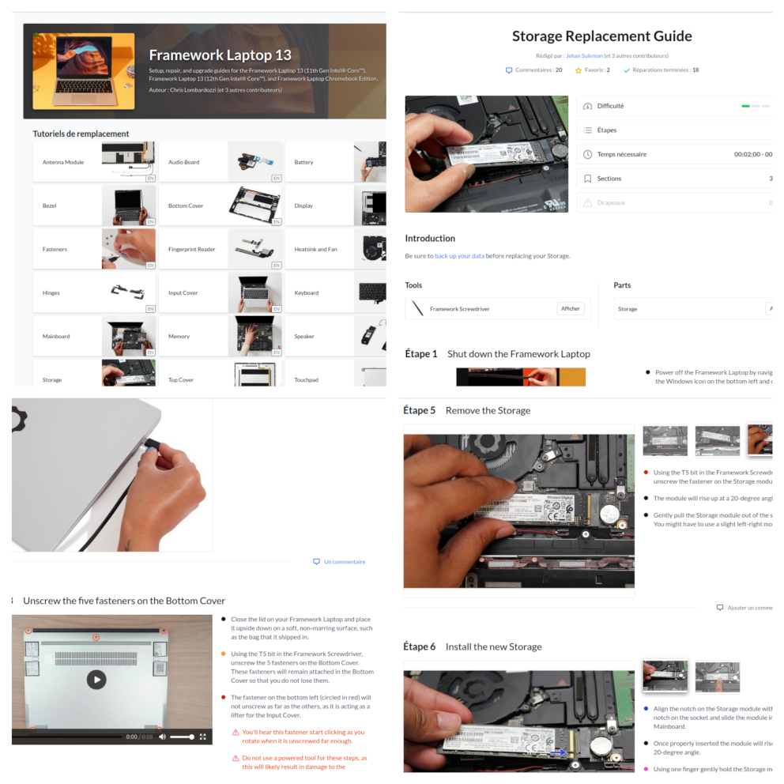

Mon arrivée dans une nouvelle aventure ! Découvrez les valeurs que j'aime chez **zatsit** et comment se passe l'onboarding.

<!-- truncate -->

Lundi ! Arrivée dans les locaux, je suis accueilli par Flavien (un des co-fondateurs) et Océane (notre chargée de missions RH de choc). Un bureau m'attend avec quelques goodies estampillés aux couleurs de l'entreprise : gourde en métal recyclé, sweat (dont le fabricant et membre de [fairwear.org](https://www.fairwear.org)), sticker et un petit mot d'accueil qui me font très plaisir. 

La matinée commence par la partie administrative (ce que tout le monde « adore », n'est ce pas ?)
- les divers documents à fournir et quelques validations d’identité habituelles.
- On active mes accès à [Ekip](https://www.ekip.app/). Je découvre ainsi les tickets restaurants **écoresponsables**.
- Puis avec Océane on passe en revue les accès aux outils qui permettent le suivi pour mes futures missions. D'ailleurs, **zatsit** a mis en place une plateforme dédiée pour l'onboarding des consultants, permettant de mettre en avant les quelques « formations » a dérouler pour être opérationnel. 

On reparle avec tous le monde de ce l’on veut construire à l’avenir et des impacts que veut avoir **[zatsit](https://zatsit.fr/)** sur les aspects sociétal et environnemental.

Ce qui m’amène à vous parler du choix sur le matériel qu’a fait la société.

## Mon meilleur moment de la journée : la découverte de mon outil de travail

Peu de temps avant mon arrivée, j’ai reçu un message qui me demandait de choisir la configuration de mon futur poste de travail [Framework](https://frame.work/fr/fr).

J’ai ainsi découvert leur concept : proposer du matériel réparable et évolutif. Ce choix permet à **zatsit** de rester cohérent dans sa politique environnementale et avoir un impact le plus restreint possible sur la planête.

J’ai donc choisi les différents éléments de ma machine : un 13 pouces avec coque en aluminium, le processeur, la ram, le disque, les extensions… Et pour le fun, le montage à faire par mes soins pour prendre en main l'assemblage du hardware.

Donc tout était là, dans un carton contenant les diverses parties de mon ordinateur. Quand on a l’habitude de monter des configurations, et comme tout est suffisamment indiqué sur la carte mère, l'assemblage se fait plutôt facilement et en quelques minutes : on installe le disque SSD et la mémoire, on referme avec le couvercle, qui est le clavier, on serre quelque vis avec l’outil qui est fournit, et **zatsit** !

Le petit plus sympa : le contour de l’écran est amovible et il existe plusieurs couleurs. Moi, j’ai choisi le orange.

Pour pouvoir alimenter la machine et la connecter à des périphériques, il y a 4 emplacements qui peuvent recevoir des modules d’extension en tous genres : USB type A ou C, HDMI, Ethernet et autres que l'on peut interchanger, et à chaud.

Et pour certaines extensions, on peut également y ajouter un peu de couleur.

Une fois tout en place, j’ai installé une distribution Linux (Ubuntu 24.04) à partir d’une clé USB que j’avais préparé en avance en suivant les [indications fournies sur le site du fabriquant](https://guides.frame.work/Guide/Ubuntu+22.04+LTS+Installation+on+the+Framework+Laptop+13/109).

Et tout était fonctionnel au premier démarrage !

J’ai commencé à travailler sur ce poste après avoir configuré un environnent de développement. Je suis enthousiaste à l’idée d'utiliser ma machine lors de mes missions.

Parcourir le site de Framework [Framework](https://frame.work/fr/fr) est intéressant : 
- On y découvre que beaucoup de matériaux constituant les postes de travail sont en bonne partie recyclés.
- Qu’il est aussi possible de commander tous les composants séparément (cela va jusqu'au kit de visserie) ce qui permet de réparer ou de faire évoluer sa configuration facilement au fil des années (Idée que je trouve intéressante quand on à déjà ouvert un ordinateur portable et de constaté que l’on ne pourra pas faire grand chose pour se dépanner)
- Pour chaque composant proposé sur la marketplace, il existe un tutoriel de remplacement avec la difficulté, les étapes et le temps nécessaire à l'opération. Ce qui permet d'effectuer facilement la maintenance de son poste de travail par ses propres moyens.

## En attendant de démarrer mon nouveau projet client...

En attendant mon démarrage chez un client, j'en ai profité pour commencer les *Classrooms* élaborées par **zatsit**.

Les premiers ateliers m’ont permis de découvrir les principes de l’éco-conception ou d’étudier et de comprendre les solutions de monitoring pour l’empreinte carbone de projets cloud. 

La société veut sensibiliser ses collaborateurs aux impacts environnementaux de nos métiers. 

Des sujets très intéressants et que j’avais un peu survolé jusqu’à aujourd’hui. Cela va **impacter** ma façon de concevoir mes futurs projets en tant que technical leader.

J'ai pu collaborer à un premier projet, qui m'a fait découvrir certaines solutions de Firebase et Google Cloud Platform, auquel mes collègues pourront contribuer dans les semaines qui arrivent.
## Mon avenir chez zatsit ?

Je suis persuadé que les mois à venir vont être enrichissants et vont me faire grandir.

D’une part, l’équipe **zatsit** est à l’écoute quant à mes souhaits sur le périmètre de mes futures missions, mes envies de découvrir d’autres écosystèmes chez nos clients, et de me donner l’opportunité de faire mes preuves en tant que tech lead.

D’autre part, je vais pouvoir participer à des projets internes toujours en lien avec les convictions de la société qui vont favoriser les échanges au sein d’un collectif de passionnés.

Pour donner un exemple, on se prépare à participer à l’Hacktoberfest, événement qui encourage les développeurs à contribuer sur des projets open source.
Il se peut d'ailleurs que l’on se croise lors d’un BBL, ou d’un Meetup sur des sujets passionnants organisé par **zatsit**

Alors, prêt à rejoindre l'aventure **zatsit** ?