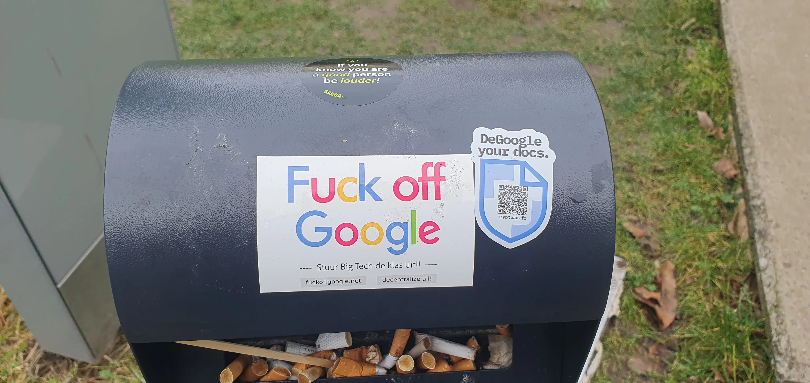

# FOSDEM 2026 : Quoi de neuf dans le monde de l'open source ?

La FOSDEM (Free and Open Source Software Developers' European Meeting) est un événement annuel qui rassemble les acteurs et actrices de l'open source du monde entier. Pour la 3e année consécutive, votre serviteur a pris sur son temps libre pour se rendre à Bruxelles et assister à une douzaine de conférences sur les plus de 1000 qui se tenaient ce week-end du 1er et 2 février 2026. Voici un condensé de ce qui a retenu son attention.

## La FOSDEM : du plus utilitaire au plus expérimental

La FOSDEM est à l'image de l'open source : c'est un événement gratuit qui tient grâce à l'engagement de certains acteurs privés (comme Google), de fondations liées à l'open source (comme Red Hat), de partenaires publics (comme l'Université Libre de Bruxelles) et surtout de centaines de bénévoles qui organisent l'événement, accueillent les participants, et surtout créent le contenu des plus de 1000 conférences qui se tiennent pendant ces deux jours.

Dans ce contenu, on trouve de tout : des conférences très techniques sur des sujets de niche, des conférences plus généralistes sur les tendances du moment. On peut autant ressortir d'une conférence en se disant « j'ai hâte d'utiliser ça dans mon projet »[^1] que « je n'ai pas compris la moitié de ce qui a été dit, mais c'était fascinant » (en passant par de franches tranches de rire en écoutant les mésaventures d'un mainteneur open source face à des utilisateurs et utilisatrices pas toujours très compréhensif·ve·s).

[^1]: D'ailleurs, c'est exactement ce qui s'est passé avec [OpenRewrite](https://blog.zatsit.fr/blog/openrewrite/), découvert à la FOSDEM 2023 et depuis intégré dans mes projets !

## Un peu de Java, des containers et des nouveautés dans l'OpenID

Au rang des conférences que je vais définitivement vouloir réutiliser dans mes projets, j'ai retenu celles-ci :

- [Java Memory Management in Containers](https://fosdem.org/2026/schedule/event/QQFMBG-java-container-memory-management/)
- [Reducing container images size with eBPF & Podman](https://fosdem.org/2026/schedule/event/VFDMGL-podman-ebpf-profiling/)
- [An Introduction to the OpenID Shared Signals Framework](https://fosdem.org/2026/schedule/event/ATMQVL-intro-to-shared-signals-framework/)

Forcément, on a tous nos biais : en tant que développeur backend Java, la gestion de mémoire et la taille de mes conteneurs sont des problématiques auxquelles je suis confronté dans mon travail quotidien. Et même si j'utilisais déjà quelques options de la JVM pour tweaker la gestion de mémoire dans mes containers, j'ai appris pas mal de choses. Par exemple, saviez-vous que les différents distributeurs de Java livrent des versions de l'OpenJDK avec des gestions de mémoire différentes ? Ainsi, le Maximum Heap Size par défaut de Java 21 est 25%, mais la version de Red Hat, optimisée pour le déploiement en container, est livrée avec un Maximum Heap Size par défaut à 85% ! Et c'est logique : quand on tourne dans un container entièrement dédié à notre JVM, on peut récupérer plus d'espace mémoire.

J'ai aussi suivi avec beaucoup d'attention Axel Stefanini (de chez Red Hat justement) qui nous a présenté comment, grâce à [eBPF](https://ebpf.io/what-is-ebpf/), il a pu monitorer ses déploiements et identifier tout ce qui était inutile dans ses containers, pour ensuite réduire drastiquement la taille de ses images (une approche similaire aux images distroless dont on parle de plus en plus ces dernières années). Plus qu'une question de performance, c'est aussi une question d'empreinte carbone : plus les images sont légères, moins elles consomment de ressources pour être transférées et stockées. Et chez Zatsit, ce genre d'approche nous parle beaucoup !

Le dimanche, j'ai sacrifié ma grasse matinée pour assister à la conférence de Thomas Darimont sur une nouvelle fonctionnalité du standard OpenID : le Shared Signals Framework. Cette nouvelle fonctionnalité permet de partager des signaux entre fournisseurs d'identité et clients. On est tous désormais plus ou moins familiers avec l'utilisation des fournisseurs d'identité comme [Keycloak](https://www.keycloak.org/), qui nous permettent de nous identifier sur plusieurs ressources grâce à un fournisseur d'identité unique. Mais voilà : aujourd'hui, notre fournisseur d'identité ne peut pas communiquer à son initiative avec les clients qui l'utilisent. C'est ce que viennent permettre les Shared Signals. Si par exemple vous avez utilisé Google pour vous connecter à votre compte GitHub, ainsi qu'à un service de streaming, et puis bien sûr à votre client mail, et que malheureusement quelqu'un a deviné votre mot de passe (il faut dire que « adminPassword123 » ce n'était pas très compliqué) : Aujourd'hui, Google se rendra probablement compte que quelque chose n'est pas clair (en fonction de l'origine de la connexion par exemple), mais il ne sera pas en mesure d'avertir les autres clients que la sécurité de votre compte a été compromise. Demain, grâce aux Shared Signals, Google pourra envoyer un signal à tous les clients qui l'utilisent comme fournisseur d'identité pour les avertir que votre compte a été compromis, et ainsi permettre à ces clients de révoquer vos sessions actives ou de vous demander de changer votre mot de passe. Que ce soit pour la sécurité en entreprise ou pour nos utilisations du quotidien, c'est une fonctionnalité qui peut faire une grande différence et qui deviendra très certainement un standard dans les années qui viennent.

## Linux on mobile et reverse engineering Spotify

La FOSDEM, c'est aussi l'occasion de découvrir des sujets plus expérimentaux. En tant qu'aficionado de custom ROM Android et pourfendeur de l'obsolescence programmée, j'ai été très intéressé par [la conférence d'Affe Null](https://fosdem.org/2026/schedule/event/9KYVGM-jolla-c2/) sur son portage de Linux mainline (c'est-à-dire du kernel Linux sans modification) sur mobile. On est loin d'avoir un mobile utilisable au quotidien pour l'instant, mais c'est toujours très inspirant de voir des passionné·e·s (surtout si jeunes !) se lancer dans un reverse engineering complexe et l'écriture de drivers à la main, juste parce qu'ils étaient curieux de savoir comment ça marche.

Dans la catégorie projet expérimental, la conférence de devgianlu [Reverse Engineering the World's Largest Music Streaming Platform](https://fosdem.org/2026/schedule/event/RNBQ8U-reverse-engineering-spotify/) m'a aussi marqué (comment ne pas l'être quand le conférencier commence par ce disclaimer : « If there's someone from Spotify in the audience, please don't sue me. Let's talk first »). Plus qu'une lubie de passionné, ce genre de projet est aussi la ligne de front de la lutte contre les pratiques anti-consommateurs de certaines grandes entreprises. Parce qu'être en maîtrise de son matériel et de ses logiciels, c'est aussi être en maîtrise de ses données et de sa vie privée.

## Forcément, de l'IA

Impossible de passer à côté de la révolution de l'IA générative à la FOSDEM. Mais au-delà des alternatives open source aux LLM bien connus, la FOSDEM est aussi l'occasion d'aborder le sujet sous un angle qu'on n'entend pas assez dans nos métiers : [What do we mean when we say Sovereign AI?](https://fosdem.org/2026/schedule/event/HEGWFW-defining_sovereign_ai/) par Katharine Jarmul nous a offert une réflexion nécessaire sur la dépendance de nos entreprises et de nos États à des entreprises étrangères, notamment états-uniennes, pour l'accès à des modèles d'IA générative.

Face aux changements géopolitiques et aux renversements alliances de ces derniers mois, il est plus que jamais nécessaire de se poser la question de la souveraineté numérique et de l'impact que cela peut avoir sur nos entreprises, nos données et notre vie privée. Il faut aussi sortir de la croyance que seules les USA seraient capables de faire de l'IA : il existe des alternatives européennes, et même françaises, qui sont à la pointe de la technologie et qui méritent d'être soutenues.

Grâce à Effie Mouzeli et sa conférence [Running Wikipedia on Bare Metal, Open Source, and a Healthy Dose of Caching](https://fosdem.org/2026/schedule/event/YDLGLN-running_wikipedia_on_bare_metal_open_source_and_a_healthy_dose_of_caching/), j'ai aussi appris que l'IA menace directement la pérennité de Wikipédia. Non pas (seulement) parce qu'elle se nourrit gratuitement du travail de tous les contributeurs et contributrices de Wikipédia pour s'entraîner et recracher ce savoir sans jamais rien donner en retour, mais surtout parce que les bots IA et les outils de scraping qui assaillent continuellement Wikipédia font exploser le trafic et ses coûts d'infrastructure... encore une fois, sans jamais rien donner en retour.

Autant de rappels à l'importance de soutenir les projets open source et à réfléchir à notre usage de l'IA. Ne soyons pas des parasites, soyons des contributeurs et contributrices, des utilisateurs et utilisatrices responsables, et des défenseurs et défenseuses de l'open source !

## Conclusion

Cette édition 2026 de la FOSDEM a encore une fois confirmé que l'open source est bien vivant et continue d'innover sur tous les fronts. Plus qu'un simple événement technique, la FOSDEM nous rappelle que derrière chaque ligne de code se cache une communauté engagée pour un numérique plus libre, plus transparent et plus éthique. Rendez-vous l'année prochaine pour découvrir les prochaines innovations de l'écosystème open source !