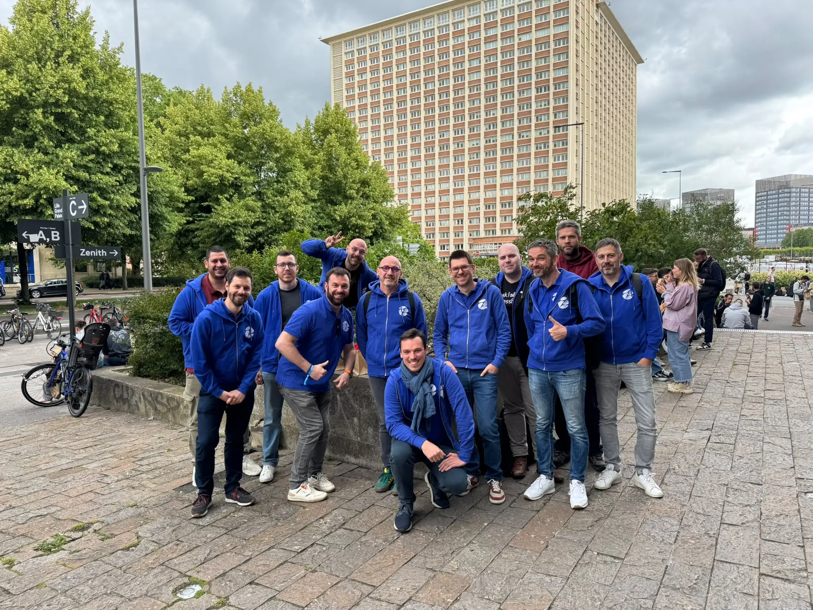
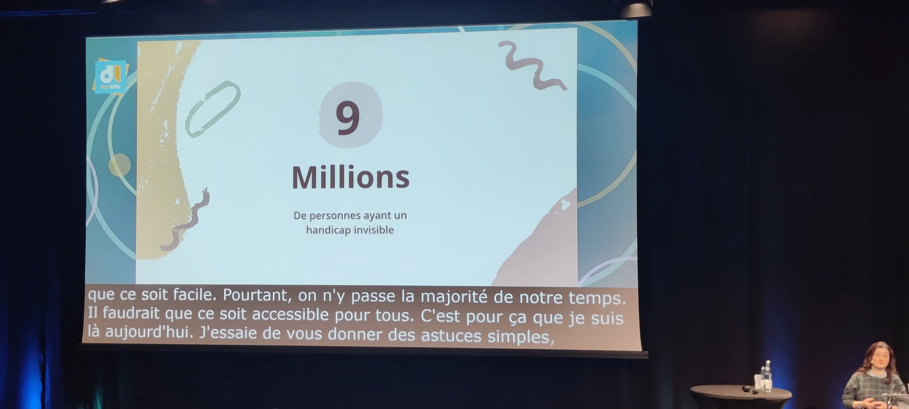
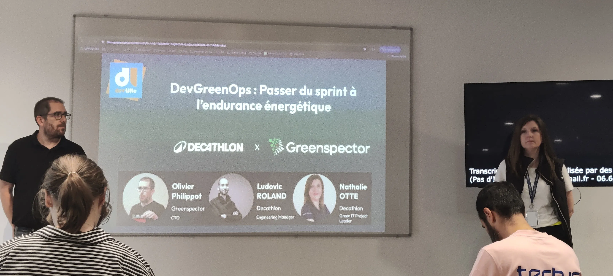
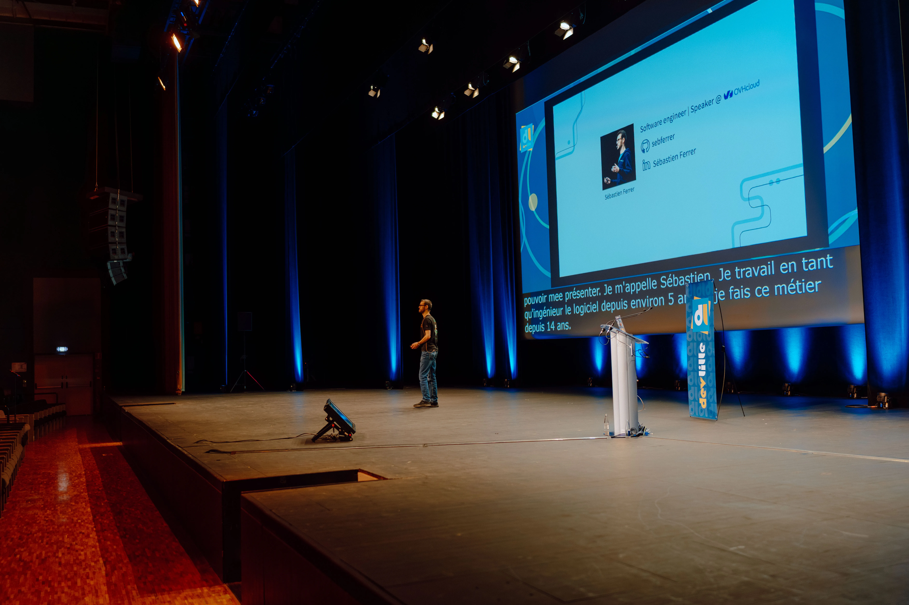
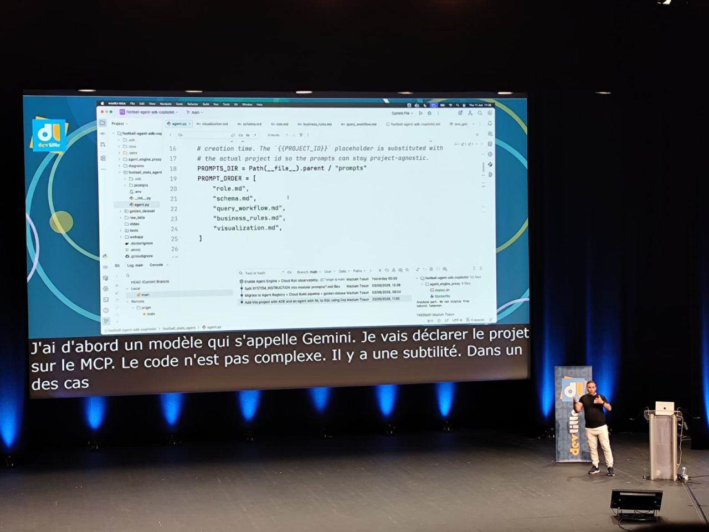
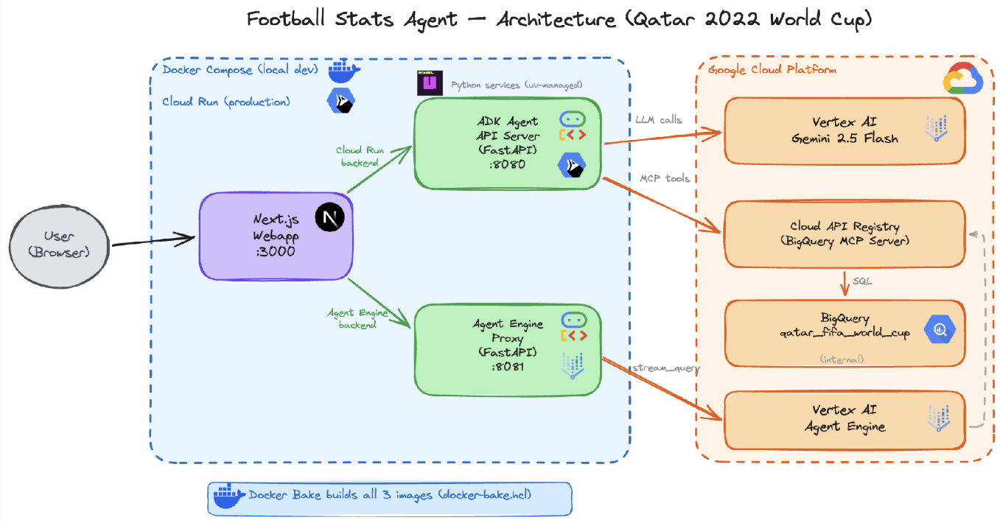
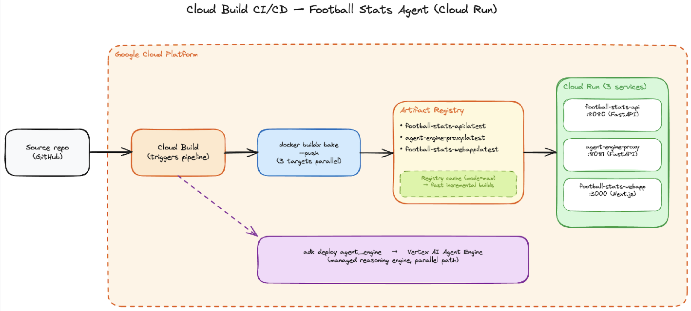
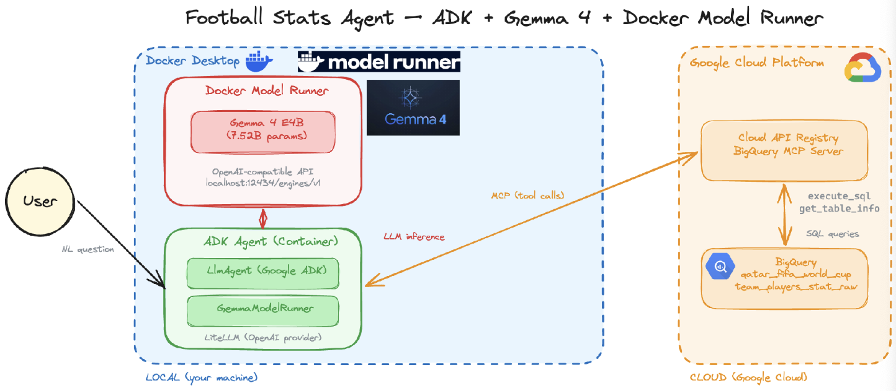
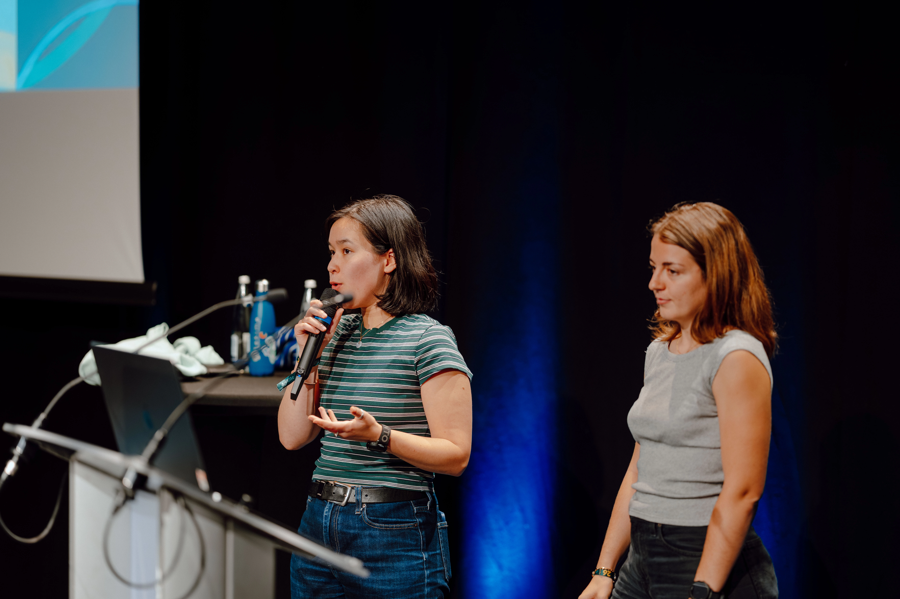
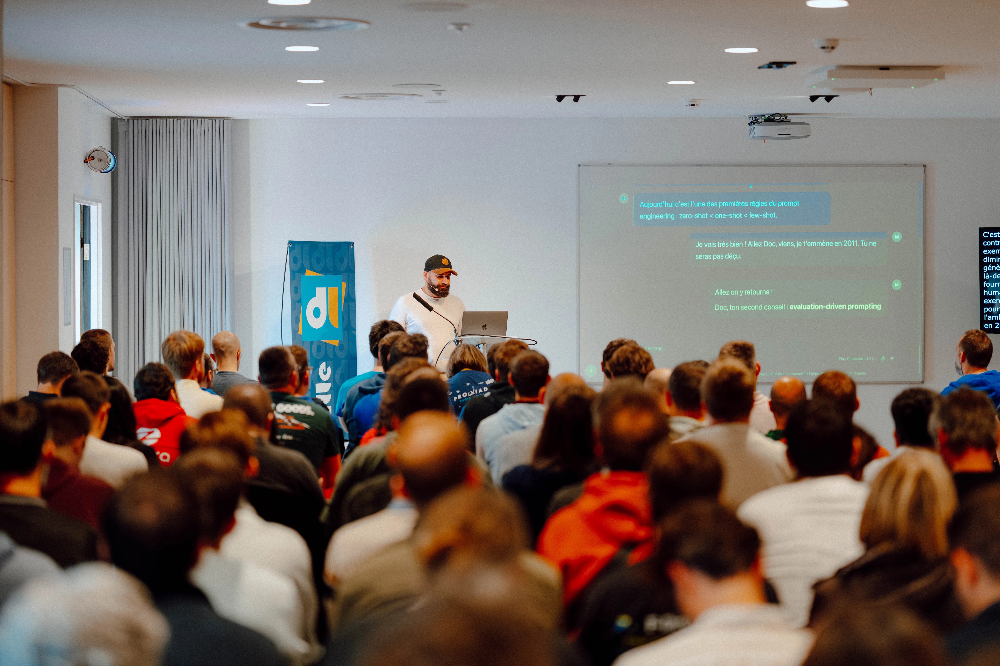

Retour sur notre visite à DevLille 2026 : les conférences qui nous ont marqués, celles qu'on a données, nos coups de cœur...
Revivez à travers les yeux des talents de **zatsit** la conférence incontournable du nord de la France !

<!-- truncate -->

## DevLille, c'est quoi ?

C'est chaque année le rendez-vous à ne pas manquer pour les passionnés de tech : Dev, Ops, Architecte... L'occasion de croiser d'anciens ou futurs collègues,
de découvrir ou redécouvrir des technos, parfois sous un angle surprenant, pourquoi pas déroutant même. Nous espérons que vous avez déjà vécu une édition,
si ce n'est pas le cas, il faudra remédier à ça l'année prochaine.

Par cet article, nous tenons à réitérer nos remerciements à l'équipe organisatrice.
Perte de sponsor, mouvement social (compréhensible, bien sûr, mais par nature imprévisible), inflation... autant d'obstacles à franchir pour
garantir une conférence sur deux jours sans accrocs. Comme les meilleurs numéros d'acrobatie, si on ne ressent pas la difficulté, c'est que c'est bien maîtrisé !

Plongez avec nous dans les conférences qui nous ont marqués, mais avant petit clin d'œil à notre participation.

## zatsit à DevLille
Tout les ans, notre collectif se retrouve pour participer à DevLille. 
Comme chaque mois, nous profitons d'un **zatsday** pour apprendre ensemble et passer un bon moment.
Cette année, plus que spectateur, nous étions aussi speaker ! 3 interventions au programme :
- **Le CDC pour ne pas DCD** par **Ludovic et Quentin** : un REX sur un produit legacy qui produisait de la donnée obsolète ou manquante, sauvé en adoptant le Change Data Capture.
Avec des démos autour de Debezium et Kafka, des échange sur base d'architecture event-driven et même des cadeaux à gagner, si vous aviez compté le nombre d'acronymes lors du talk.
- **Contract-First : reprends le contrôle de tes API avec des outils qui changent la vie** par **Emmanuel** : un workflow Contract-First complet
où le contrat OpenAPI devient source de vérité (mock avec **Microcks**, lint avec **Vacuum**,
rétrocompat avec **Openapi-diff**, tests...), le tout outillé par des agents IA (Claude Code, Gemini CLI) via des skills publiés sur skills.sh.
- **EcoScore A ou E : où se situe vraiment votre API ?** par **Emmanuel** : comment mesurer l'éco-conception d'une API via deux référentiels open source complémentaires, API Green Score
et EROOM de Boavizta (maturité globale), avec à la clé un outil lui-même éco-conçu.

Ces 3 talks ne sont pas anodins, ils reflètent l'expertise et les moteurs des talents de **zatsit** : l'architecture technique et l'éco-conception.
Ces deux thématiques, entre autres, animent nos **zatsdays** et notre quotidien !

## Les conférences qui nous ont marqués

"Choisir, c'est renoncer", c'est déjà assez difficile le jour J de choisir entre les 3 tracks, alors la sélection qui suit l'est encore plus.

### Handicap invisible : l’accessibilité commence dans les réunions (et l'IA peut aider)
_Vu par Emmanuel_

Par [Anaïs Moulin](https://www.linkedin.com/in/anaismoulin/)

Anaïs nous le confie elle-même, elle a un handicap invisible, elle est sourde de l'oreille droite.
C'est donc plus facile de lui parler du côté gauche lors de la pause café, mais c'est une autre histoire lors des réunions physiques et à distance.

Le chiffre de la photo ci-dessus est énorme, 9 millions de Français ont un handicap invisible, parmi ces handicaps, les 6 grandes familles les plus représentées :

- **Maladies chroniques** invalidantes : sclérose en plaques, fibromyalgie, endométriose, diabète... La catégorie la plus large.
- Troubles **sensoriels** : surdité, malentendance (le cas d'Anaïs Moulin), déficiences visuelles partielles.
- Troubles **psychiques** : dépression, troubles anxieux, bipolarité, schizophrénie.
- Troubles **neurodéveloppementaux** : TDAH, troubles du spectre autistique, souvent diagnostiqués tard.
- Troubles **« dys »** : dyslexie, dyspraxie, dyscalculie, avec un impact direct sur la lecture et le traitement de l'info à l'oral ou l'écrit.
- Troubles **cognitifs** : mémoire, attention, difficultés à planifier...

Il y a donc une forte probabilité pour que vous ou l'une des personnes de votre équipe ait un handicap de cette liste.
Ces personnes font déjà énormément d'efforts pour aménager comme ils peuvent leurs conditions de travail afin de limiter les difficultés qui en résultent.
Elles vont, par exemple, s'équiper d'un casque à réduction de bruit, d'un écran spécifique, d'un siège ergonomique très cher, d'un bureau assis/debout onéreux aussi...

Posons nous la question : "Que nous soyons concernés ou pas par un handicap, que pouvons-nous faire pour nos collègues ?"

Déjà, Anaïs nous rappelle que ce n'est pas "écrit sur le front" et que bon nombre de personnes n'osent pas en parler, alors partons du principe que statistiquement dans vos meetings par exemple, au moins une personne va devoir faire plus d'efforts que les autres.
L'exemple concret pour lequel il est facile d'avoir un impact positif sont les "réunions" :
- Allumer sa caméra : c'est plus facile de voir des réactions, détecter qui parle et même potentiellement lire sur les lèvres.
- Promouvoir dans l'entreprise des solutions intégrées de génération de sous-titres.
- Prévoir un ordre du jour : handicap ou pas, c'est pénible d'avoir une réunion sans ordre du jour préalable.
- Préparer sa réunion : produire des documents en amont dont tout le monde peut prendre connaissance et prévoir un livrable en fin de réunion.

Honnêtement ça relève plus du bon sens et de l'organisation intelligente. Fini les "Point projet X" dans lesquels on doit improviser sur des questions hasardeuses, ne rien produire et prévoir la "Suite du point projet X".
C'est une liste que j'essaie d'exiger systématiquement dans mes expériences professionnelles, mais vraiment pas facile à imposer. À croire qu'on aime la réunionite exclusive et peu productive.

Alors, pour la prochaine que vous organisez, essayez de prendre le bon réflexe.

### DevGreenOps : Passer du sprint à l'endurance énergétique avec Decathlon x Greenspector
_Vu par Emmanuel_

par [Nathalie Otte](https://www.linkedin.com/in/ottenathalie),
[Olivier Philippot](https://www.linkedin.com/in/olivier-philippot-06a7907/)
et [Ludovic Roland](https://www.linkedin.com/in/ludovic-roland/).

Decathlon fait partie des enseignes préférées des Français, ils font beaucoup pour le sport et ont socialement une place importante.
C'est naturellement qu'ils ont donc enclenché une démarche responsable aussi dans le numérique comme nous le rappelle Nathalie (GreenIT Leader).
Dans le talk **zatsit** qui parlait d'Écoscore, nous avons fait référence au REX de Decathlon que nous vous conseillons donc aussi ici : https://youtu.be/3Xtvw8LdYWg?si=YF3m0gT9uNP9eXI9

Dans ce talk du DevLille, nous apprenons comment l'application mobile ecommerce de Decathlon est maintenant auditée par Greenspector.
[Greenspector](https://greenspector.com) est une solution SaaS française qui mesure la sobriété et la performance
des services numériques (applications mobiles, sites web, IoT...) via des sondes d'énergie réelles
sur banc de tests physiques. Elle convertit ces mesures en Écoscore et en impacts environnementaux, s'intègre dans une chaîne CI/CD : le **DevGreenOps**.

Concrètement, l'équipe réalise des tests sur devices physiques pour les builds destinés aux stores d'app.
En production, pour être fidèle à l'expérience utilisateur, des scénarios réels sont déroulés en effectuant des mesures
sur le CPU, les échanges réseaux... afin de révéler l'utilisation batterie entre autres.
La prochaine étape est de pouvoir réaliser ces tests de bout en bout pour mesurer à la fois l'efficacité frontend, mais aussi côté back.

Vivement qu'on puisse voir dans un prochain talk les résultats complets !

### Sculpter le bruit : Retour d'expérience sur la génération de textures sonores
_Vu par Emmanuel_

par [Sébastien Ferrer](https://github.com/sebferrer)

Je ne savais pas trop à quoi m'attendre avec ce talk, et c'est précisément ce qui m'a plu : ça change radicalement
de la tech qu'on voit défiler toute la journée, mais pourtant c'est de la tech ! Pas de framework, pas de pipeline, pas de cloud, plutôt de l'analyse de signal et un peu de maths.
Le point de départ : Sébastien vit avec un acouphène permanent. Plutôt que de le subir, il a cherché à comprendre comment
le son pouvait masquer ou apaiser ces fréquences parasites. Et de fil en aiguille, il s'est retrouvé à coder ses propres bruits.

Là où ça devient malin, c'est qu'on parle de quelques lignes de code, selon lui "l'algo le plus simple qu'il ait jamais écrit".
Pas de deep learning, pas de modèle entraîné sur trois data centers. De la distribution aléatoire, des filtres, un peu de manipulation de signal,
et l'algorithme pour générer du bruit rose proprement. Du chaos mathématique transformé en confort auditif,
et on voyait le son devenir image à l'écran, le spectre se dessiner sous nos yeux. On a même vu le logo DEVLILLE 2026 et ça c'était fun, effet démo garanti !
Les pièces du puzzle se sont mises en place. Tous ces bruits "colorés" qu'on croise sans jamais y réfléchir :
Le bruit blanc, agressif, sifflant, c'est exactement la neige sur les vieux téléviseurs cathodiques (pour les plus anciens dans la salle).

Le bruit rose, plus doux, plus équilibré, c'est celui qui peuple les playlists "sommeil" et "concentration"
de Spotify et Deezer. Si tu t'es déjà demandé pourquoi ces playlists marchent mieux que le blanc pour dormir,
c'est une histoire de répartition d'énergie par octave : l'oreille humaine le perçoit comme plus naturel,
plus proche de la pluie que du sifflement.

Le bruit brun (ou rouge, ou brownien, c'est le même), encore plus grave, ce grondement profond (comme un orage nous dit Sébastien) façon cascade ou ressac, une ambiance de plage, on sent le sable sous nos pieds.
Bref, un talk qui ne servira peut-être jamais directement dans mon job, et c'est très bien comme ça.

Parfois il faut juste une conf qui te fait regarder ton vieux poste cathodique d'un autre œil, qui explique ta playlist de concentration...

### Qui a marqué le plus de buts ? construire un agent IA qui interroge des données en langage naturel
_Vu par Ludovic_

par [Mazlum Tosun](https://www.linkedin.com/in/mazlum-tosun-900b1812/)

Mazlum, habitué du DevLille, présente un sujet concret, sur la mise en place d'un agent IA permettant d'interroger les données de la coupe du monde du Quatar.

Contrairement à la majorité des talks, celui-ci présente les technologies, l'architecture et le workflow de CI utilisés pour en venir à une démonstration de l'intégration de la stack, d'abord en local, puis déployée sur GCP dans Cloud Run.

L'application s'articule donc autour de 4 composants clés :

- Le front en **Next** qui intègre [Copilot Kit Lit](https://github.com/copilotkit/copilotkit), pour l'intégration IA 
- [Agent Development Kit (ADK)](https://adk.dev/) coté backend, pour le framework permettant d'orchestrer les agents
- **Vertex AI** coté Google, permettant de fournir un LLM pour converser (Gemini 2.5 Flash) ici
- **BigQuery** et son **MCP** pour la source de donnée (données de la CDM au Quatar)

Coté CI, du classique sur GCP pour orchestrer le déploiement vers Cloud Run :

En 45 minutes, Mazlum a donc permis à l'auditoire de comprendre comment créer sa première plateforme conversationnelle, sur base d'exemples, de schémas et de démonstrations. C'est ce qu'on attend, quand on participe à une conférence : repartir avec des choses à actionner !

Le clou du spectacle ? La possibilité de s'amuser avec cette stack exclusivement en local, sans consommer de tokens IA :

On adore !

Si vous voulez aller plus loin : 

- [Les slides](https://docs.google.com/presentation/d/19iBG2qq_2fFLu2J2NDfEkp0fsZD2Lzu9/edit?usp=sharing&ouid=106953247454474350663&rtpof=true&sd=true)
- [Le code source du projet](https://github.com/tosun-si/football-agent-adk-copilotkit)

### Déployer souvent, stresser moins : feature flags en prod critique
_Vu par Quentin et Ludovic_

par [Marion Chineaud](https://www.linkedin.com/in/marion-chineaud-98000b214/) et [Elise Souvannavong](https://www.linkedin.com/in/elise-souvannavong-insa/)

Dans ce talk du DevLille, Marion et Elise nous embarquent dans leur méthodologie pour livrer plus vite, sans friction entre la tech' et le métier.
Elles y détaillent quelques techniques pour mitiger les risques d'un déploiement et pour permettre aux équipes en charge du métier de tester leurs idées sans impacter le delivery et les utilisateurs.

Tout le monde sera d'accord pour dire que pour déployer souvent, il faut d'abord découper et merger fréquemment son code. Et ce que suggèrent Marion et Elise, c'est de séparer l'action de merger et de déployer. C'est vrai que bien souvent, on attend que tout soit prêt à être déployé pour être mergé et l'on entre dans des tunnels. Et pour éviter d'impacter les utilisateurs avec des demi-features, elles suggèrent d'utiliser des release flags : des booléens, stockés de préférence séparément de la codebase, pour activer ou désactiver des features.

Dans une seconde partie du talk, Elise et Marion évoquent la volonté de l'équipe métier de pouvoir piloter l'application avec des flags, afin de réaliser des tests. On parle alors d'A/B testing (tests de variants d'une feature afin de choisir celle qui correspond le mieux aux utilisateurs), shadow mode (déploiement d'un service critique en parallèle de l'application afin de tester son comportement en conditions réélles) ou de canary release (release différenciée suivant la typologie d'utilisateurs afin de recueillir des feedbacks des bêta-testeurs avant une mise en production généralisée). Des concepts intéressants, à mettre en pratique si le besoin se fait ressentir dans les équipes !

Un warning tout de même : les flags c'est beau mais ne pas oublier le clean après les releases !

Le mot de la fin : faire d'une release un non-évènement, je pense que c'est ce vers quoi tout développeur/toute développeuse veut aller

### IA et bonnes pratiques: Nom de Zeus, on savait déjà tout !
_Vu par Quentin et Ludovic_

par [Nathan Castelain](https://github.com/nathancastelein)

Dès le début du talk, nous sommes embarqués dans l'univers de Retour vers le Futur. Le pitch ? Nathan arrive en 2026, au moment où l'IA est prédominante dans le quotidien des développeurs. Le Doc est lui même une IA qui dicte les bonnes pratiques en terme de prompting et d'utilisation de l'IA agentique. Mais, Nathan vient de 2024, une époque où l'IA pour les développeurs se limitait à poser des questions dans un chat et copier éventuellement le snippet de code, bien loin des pratiques actuelles donc !

Le but de ce talk est de déconstruire les concepts du moment autour de l'IA agentique (Context Engineering, Prompt Engineering, etc...) et de les croiser avec des concepts et pratiques de développement existants depuis quelques décennies, comme l'agilité et son manifeste, le Behavior Driven Design, le Domain Driven Design, ...

Un talk qui invite à prendre du recul sur l'utilisation de l'IA et à se rappeler que, finalement, on n'a rien révolutionné en termes de concepts. Le Context Engineering n'est qu'un nouveau nom pour des réflexes qu'on connaît bien : découper, donner du contexte métier, structurer l'intention avant de produire. La vraie nouveauté, elle, est ailleurs : on écrit (ou plutôt on fait écrire) du code plus rapidement. Reste à savoir si nos pratiques craft suivront le rythme.

## Conclusion

On repart avec deux sentiments :
- On a fait notre possible pour proposer des talks à notre image : de l'architecture technique, de la plomberie technique, pragmatique
- et même de l'éco-conception, parce que c'est une urgence !
- On a adoré croiser nos collègues, avoir de l'inspiration et prendre le pouls de la tech lilloise.

Comme chaque année, ça nous semble naturel, chez **zatsit** d'emmener tout le collectif prendre une bonne bulle d'air tech et quand on voit que certains pairs ne sont jamais allés
à une conférence, c'est triste. Chacun dans notre métier doit produire un travail de veille personnel, c'est sûr, mais l'entreprise a le devoir de former son collectif
de l'emmener voir d'autres horizons, même si ce n'est qu'à quelques kilomètres, le savoir ne vaut que s'il est partagé !