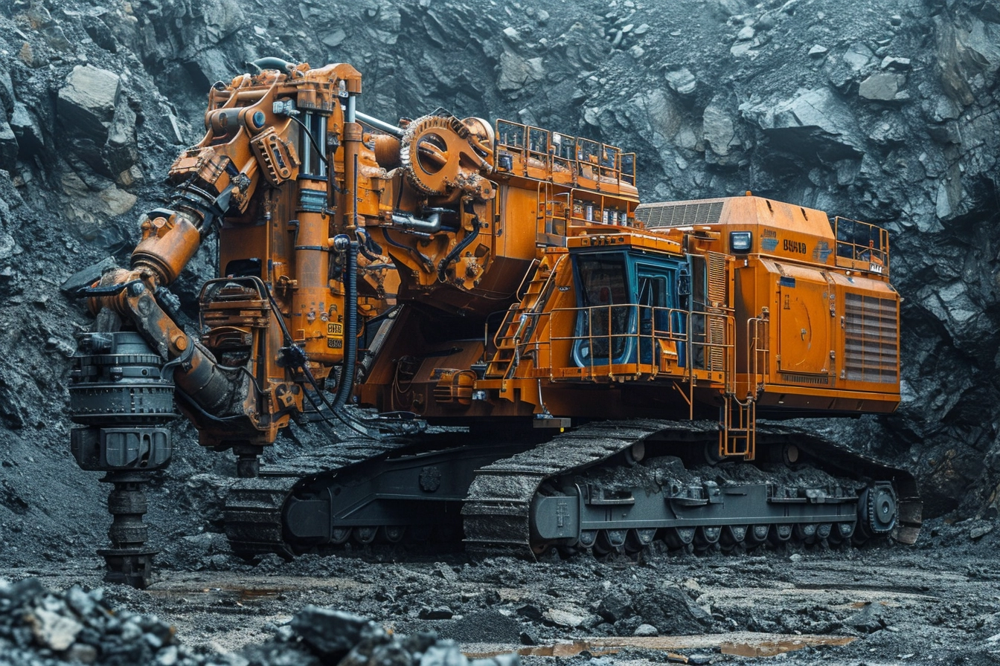
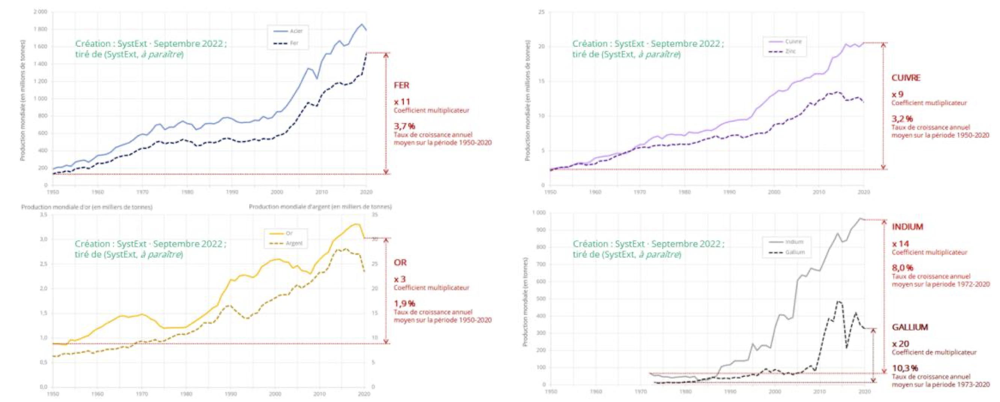
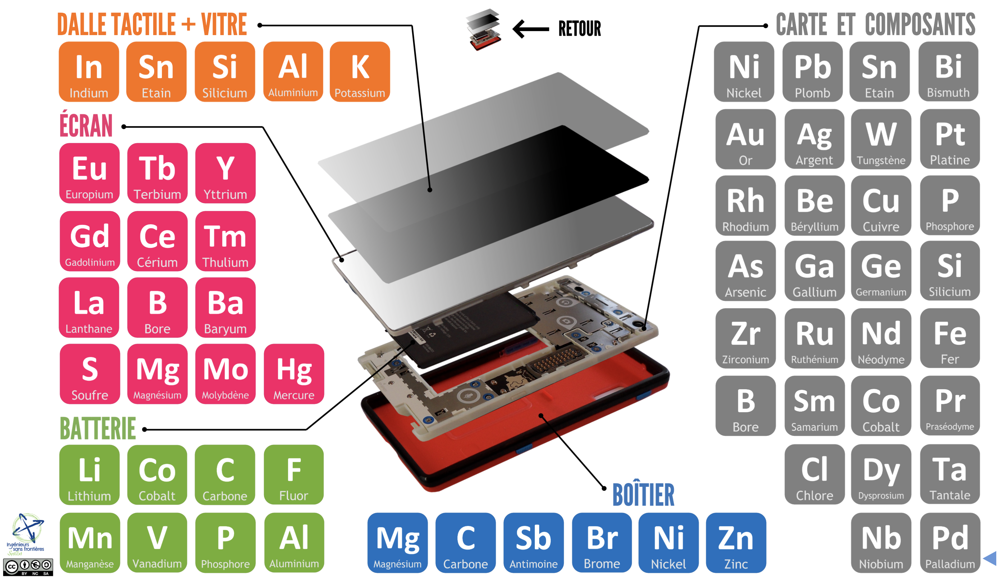
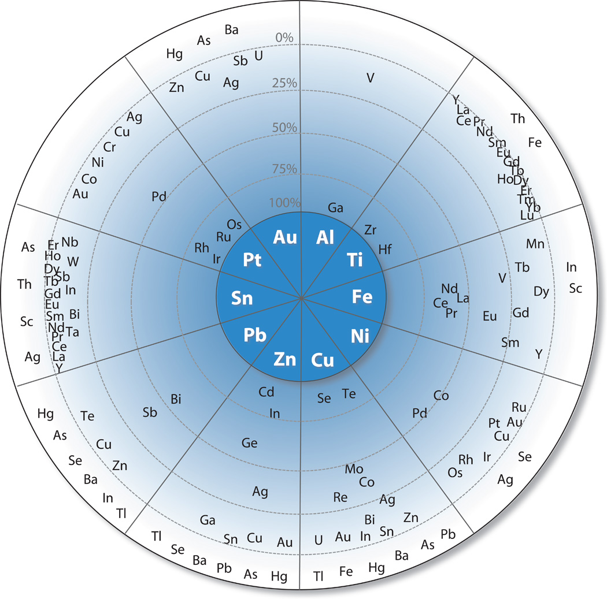
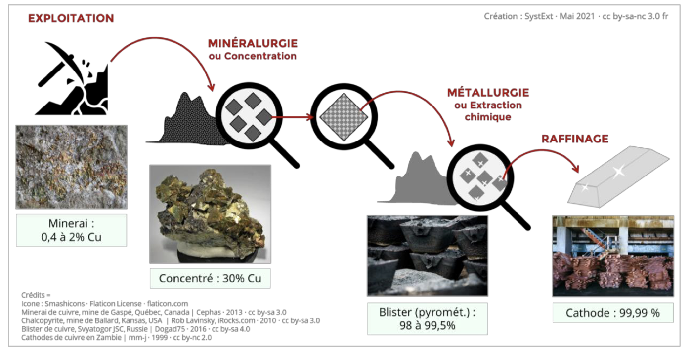
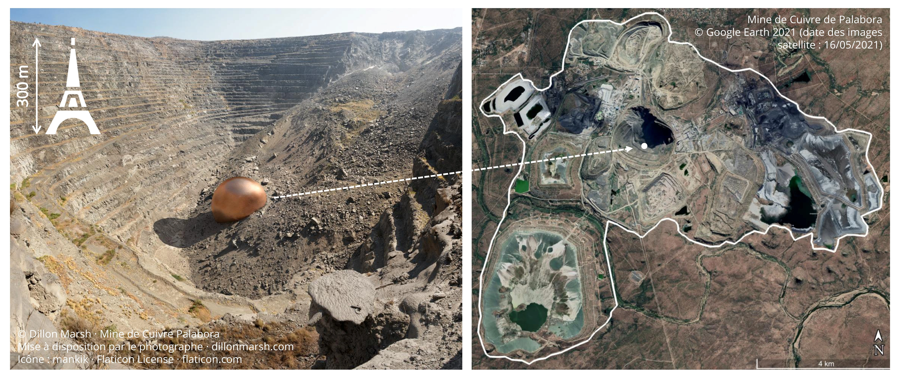
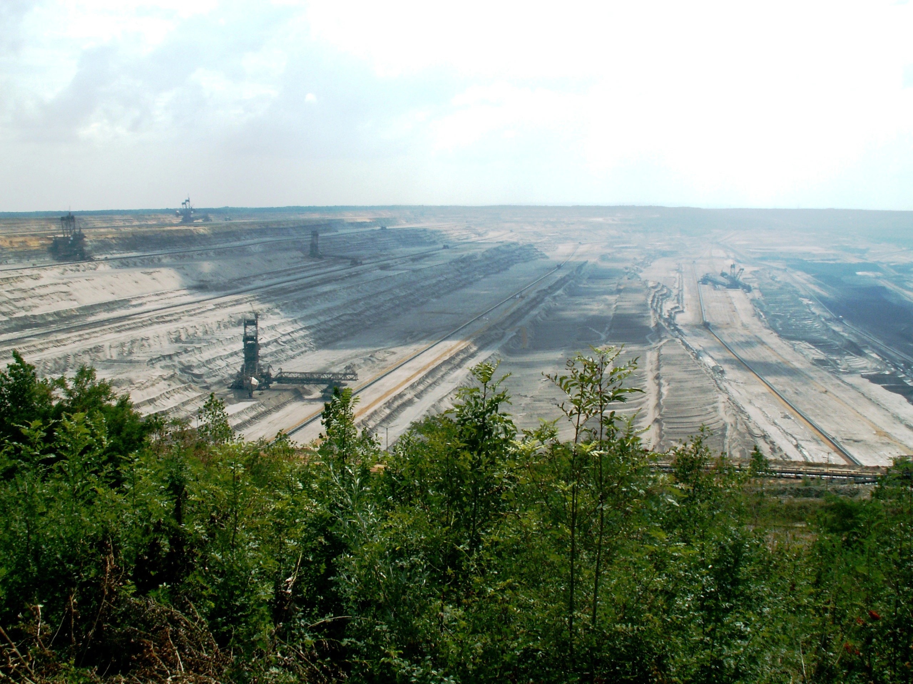

Le printemps 2024 est terminé (si vous l'avez vu passé) et nous voyons clairement que nous commençons à manquer de prénoms pour les tempêtes,
que les normales de saisons ne sont plus vraiment normales, que la sécheresse ou à l'inverse 
les innondations sont importantes et plus seulement au bout du monde, mais au plus près de nous.

L'empreinte de l'industrialisation est avérée dans l'augmentation, des gaz à effet de serre, mais l'empreinte liée aux matières 
premières nécessaires à cette industrialisation et à ses produits finis l'est moins.
Entre les deux, il y a bien sûr la consommation énergétique liée à l'extraction, la fabrication, la distribution et l'utilisation.

Je vous propose une série d'article consacrée aux impacts du numérique sur notre environnement et nous commencençons par une des sources : les matières premières, surtout les métaux.

<!-- truncate -->

## Mine de rien, ça en fait des cailloux !

Nous pourrions prendre d'autres produits de la vie courante pour illustrer les propos, mais nous nous interessons ici au numérique.
Ces dernières décénnies, il y a eu énormément de progrès dans les domaines de l'informatique, de l'électronique, de l'optique et pas
mal d'autres choses en "ique". Ces innovations ont nécessité toujours plus de matériaux, différents, plus rares les uns que les autres et disons le, personne n'a encore eu l'idée de faire massivement mieux avec moins.

Il y a quelque temps j'ai eu la chance d'assister à deux évènements plein de pédagogie : 
- La conférence d'[Aurore Stéphant](https://fr.linkedin.com/in/aurore-stephant-42097853) aux APIdays (même si j'avais déjà vu certaines de ces interventions sur Youtube et notamment ses deux passages chez Thinkerview).
- Un Meetup [Techrocks](https://www.tech.rocks/) en début d'année sur le sujet qui nous occupe.

### L'exploitation minière, toujours plus

À travers les différentes époques, la demande en métaux n'a jamais cessé de croître : il y a pu avoir des ralentissements dûs à des évènements gépolotiques ou sanitaires (guerres, épidémies...), mais la demande est toujours croissante.

*Source : https://www.systext.org/node/2058*

Plus nous avançons dans le temps et plus nous trouvons des propriétés intéressantes à des métaux et autres éléments et des applications à échelle industrielle. A tel point que nos smartphones en sont truffés, je vous invite à visiter cette [démo en ligne de Systext de composition en métaux d'un smartphone](https://www.systext.org/sites/all/animationreveal/mtxsmp/#/1) qui donne le résultat ci-dessous, avec pas moins de 60 éléments : 

*Source : [Systext](https://www.systext.org/sites/all/animationreveal/mtxsmp/#/1) *

Et oui, avec des composants comme l'Arsenic et l'Antimoine, certes en quantité minime et stabilisé dans votre smartphone, mais qu'en est-il de leur exploitation ?

Le problème c'est que les métaux sont inégalement présents dans les sols et quand on trouve plus facilement du fer et de l'aluminium, il faudra dans le meilleur des cas extraire 1 tonne de minerai pour obtenir 1g d'or.

Il existe donc des mines qui sont spécialisées dans l'extraction d'un ou plusieurs éléments, mais là où on va trouver un métal plus abondamment par exemple, on va aussi en trouver plein d'autres.

Cette infographie nous explique que pour chaque élément trouvé (au centre), on a de fortes chances de trouver les autres. 
* Plus les autres éléments sont proches du centre, plus ils ont de chance d'être récupéré comme **co-produit**
* Plus ils sont proches de l'extérieur et plus ils ont de risques d'être rejetés dans les **déchets miniers**

Pour extraire des métaux de la roche, il y a des procédés mécaniques, thermiques, chimiques pour par exemple partir de la roche et obtenir des catodes de cuivre. Tout celà avec une consommation d'eau et d'énergie phénoménale. Dans les exemples de cet article, nous sommes loin de l'image du mineur avec sa pioche sur l'épaule ou du prospecteur américain qui filtre du sable au bord de la rivière. On parle plutôt de machines gigantesques, d'explosifs et d'échelle difficilement imaginable.

*Source : [Systext](https://www.systext.org/sites/default/files/RP_SystExt_Controverses-Mine_VOLET-1_Nov2021_maj.pdf)*

## Il faut creuser un gros trou ?

Vous avez peut-être déjà vu les [photographies de Dillon Marsh](https://dillonmarsh.com/fwiw.html) qui montre "à l'échelle" la taille des mines en elle même, leur emprise sur les espaces autour, en regard de ce qui en est extrait comme produit fini.

Ci-dessous, on peut se rendre compte, avec la représentation de la tour Eiffel, de la taille d'un site (extraction + exploitation + emprise en surface des déchets) pour la **mine de cuivre** de Palabora

Située en Afrique du Sud, cette mine a été exploitée pendant presque 40 ans. ([plus de détail sur cette mine avec ce lien](https://planet-terre.ens-lyon.fr/ressource/Img784-2023-06-05.xml)).

D'autres exemples de mines gigantesques existent (cette fois c'est du charbon, mais ça symbolise bien l'extraction minière), plus proche de nous, comme la [Photo de la mine de Hambach en Allemagne](https://fr.wikipedia.org/wiki/Mine_de_Hambach#).

*Source : Wikipedia / Johannes Fasolt*

## Quelles sont les conséquences de l'exploitation minière ?

La raison principale de cette exploitation est bien entendu d'approvisionner toutes nos industries : transports, énergie, armement, agriculture... enfin tout ce qui nécessite aujourd'hui des métaux, c'est à dire à peu prés tout, dans sa composition, sa construction ou sa logistique. 

Faites l'exercice : "Quel artefact utilisez-vous dans votre quotidien qui n’est pas dépendant de l’industrie minière dans sa fabrication, sa vente, son transport ?"

### Conséquences écologiques ### 

Elles sont nombreuses : la pollution de l'air, des sols et de l'eau autour des sites est importante en "fonctionnement" normal, mais en cas d'accident c'est encore pire. On peut lire par exemple : 
- [Sur le site de l'ARIA](https://www.aria.developpement-durable.gouv.fr/accident/47369/) une catastrophe au Brésil en 2015, un village de 620 habitants est engloutit suite à une rupture de barrage de déchets de minerai de fer. 19 personnes trouveront la mort, plusieurs rivières seront polluées, une pollution se propageant jusqu'à l'océan.
- [Toujours sur l'ARIA](https://www.aria.developpement-durable.gouv.fr/fiche_detaillee/12831/) on trouve une catastrophe survenue en Espagne suite à la rupture d'une digue d'un bassin de stockage de déchets de pyrite. Des millions de tonnes d'eaux acides et de boues sont déversées dans la rivière Rio Agrio puis le Guadimar.
- [un dernier exemple en Russie](https://sg.finance.yahoo.com/news/russian-river-of-blood-leaves-locals-fearing-092205453.html) où on peut voir une rivière "sanglante" résultat de fuites de minerai. L'article expose que 210 000 personnes travaillent dans les environs pour cette industrie qui représente un cinquième du nickel mondial... 

Des procès sont régulièrement intentés contre les exploitants, cependant ça ne permet pas de réparer les dommages occasionnés. au delà des accidents, la fin d'une exploitation d'un site minier ne signifie pas la fin de sa pollution, au contraire. 

On ne dépollue pas un site minier, tout simplement parce que ce serait trop long, trop couteux, voire impossible. Chaque exploitation a donc un effet irréversible sur son environnement.

### Conséquences politiques et sociales ### 
L'extraction minière est aussi source de conflits politiques et sociales. Les ressources ne sont pas également réparties sur le globe et dans certains pays les conditions de travail des adultes et aussi des enfants sont assez "souples", dirons-nous, à l'égard de la filière.

Lors du meetup Techrocks du 8 février 2024, j'ai pu apprendre les démarches entreprises, par exemple, par Fairphone qui tente sur le long terme d'améliorer les conditions sociales autour des sites où elle source ses matériaux.
[Description de la stratégie disponible en ligne](https://www.fairphone.com/wp-content/uploads/2021/03/Fairphone_Fair-Material-Sourcing-Roadmap.pdf). 

Fairphone s'est donc déjà confrontée à la réalité du travail des enfants qui sont employés sur certaines exploitations. Une stratégie de rémunération directe des "mineurs" permet d'éliminer des intermédiaires et d'améliorer les conditions sociales des familles. Un travail qui leur a, par exemple, pris 6 ans pour le cobalt.

## Quelles solutions pour diminuer l'impact ?

Ne soyons pas pessimistes sur la capacité de l'Homme à trouver des solutions, mais nous passerons forcément à une diminution de l'usage des métaux et à l'augmentation de leur recyclage. D'abord, parce que la teneur en métaux baissent dans les exploitations et ensuite parce que ça coutera toujours plus d'énergie, qui est, elle aussi, non illimitée.

Alors à l'échelle du numérique, que pouvons-nous faire ? 

Se poser les bonnes questions sur les usages toujours plus gourmands en ressources : concevoir mieux pour utiliser plus longtemps ! Celà passe par une meilleure analyse des besoins, de faire des compromis sur les données dont on a réellement besoin, de la richesse des fonctionnalités qui induit souvent plus de complexité et donc un besoin de performance.

[Tristant Nitot](https://www.youtube.com/watch?v=LzBv5H24OxY), lors du dernier DevFest Lille, nous expliquait clairement que l'amélioration de la puissance de calcul (illustrée par laLoi de Moore) a sans cesse été partiellement annulée par la baisse de la performance et la complexité croissante des softwares. 

Nous aurons chez **zatsit** l'occasion de vous reparler des thèmes, des outils et des méthodologies autour de l'éco-conception.

Bien choisir son matériel est aussi une réalité, à laquelle tente de répondre Backmarket par exemple. Acheter un article reconditionné permet de réduire l'impact de création d'un nouveau modèle, de son transport, de sa logisqtique... Il faut 6 à 7 ans d'utilisation d'un smartphone pour "absorber" son impact, alors en changer tous les 2 ans parait compliqué à justifier. Au delà de l'obsolescence réelle, il y a l'obsolescence psychologique : le marketing qui nous martelle chaque jour qu'un stockage plus important, un énième objectif photo et des millions de pixels supplémentaires sont incontournables et nous changeront la vie.

Le site [halteobsolescence.org](https://halteobsolescence.org/) vous permet de comprendre les mécanismes de l'obsolescence programmée et d'agir.

Pour terminer, vous avez peut être entendu parler de ["l'éco design"](https://en.wikipedia.org/wiki/European_Ecodesign_Directive) directive signée en juin 2023, qui sera mise en oeuvre en mars 2025 et obligera les fabricants à fournir 5 ans de support après la fin de la mise sur le marché d'un produit. Donc, un téléphone ou ordinateur en vente une seule année en 2025 devra avoir un support jusqu’en 2030 ! 

En France aussi, la loi [AGEC](https://www.ecologie.gouv.fr/loi-anti-gaspillage-economie-circulaire) demande aux acteurs public d'avoir un minimum de 20% d'achats de matériel reconditionné, ce qui pose quelques problèmes dans l'approvisionnement aujourd'hui, mais espérons que la situation s'améliore.

On associe souvent l'empreinte écologique du numérique à la consommation d'énergie, sur laquelle nous ferons un prochain focus, mais cet article souhaitait mettre l'accent sur l'envers du décor des équipements numérique et leurs conséquences. 

Soyez curieux à votre tour, chercher de l'information dans les sources citées (et d'autres) pour vous faire votre propre opinion et peut-être changer quelques habitudes.

### Ressources : 
- [USI 2022 "Ruée minière au XXIè siècle : jusqu'où les limites seront-elles repoussées ?"](https://www.youtube.com/watch?v=i8RMX8ODWQs)
- [Compléments de sources d'entretien ](https://www.systext.org/sites/default/files/RP_SystExt_Thinkerview-2-Sources-Complements_Mai2023.pdf)
- [Rapport Tome 2 · Meilleures pratiques et mine « responsable »](https://www.systext.org/sites/default/files/RP_SystExt_Controverses-Mine_VOLET-2_Tome-2.pdf)
- [Ressources minières en France](https://www.mineralinfo.fr/fr/ressources-minerales-france-gestion/mines-france)
- [By-product metals are technologically essential but have problematic supply](https://www.science.org/doi/10.1126/sciadv.1400180)

