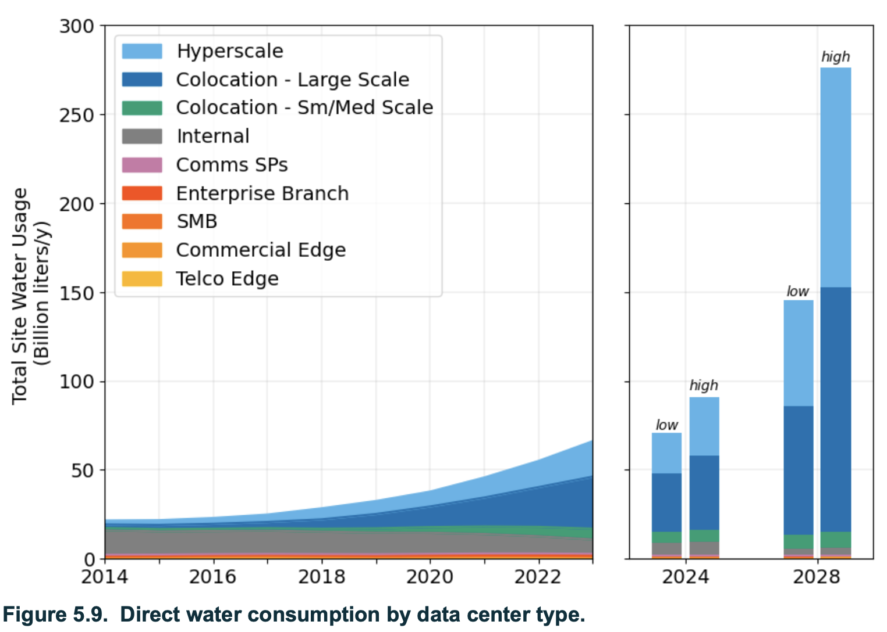
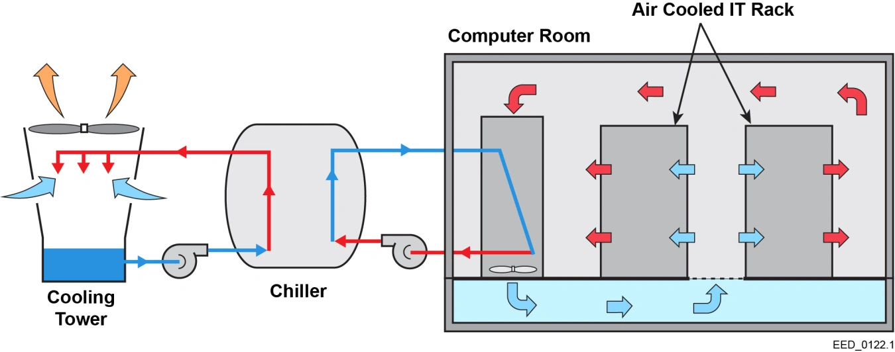

Nous aimerions tous que ce ne soit qu'une goutte d'eau dans l'océan, malheureusement la réalité se mesure en centaines de milliards
de litres. Je veux bien sûr parler ici de la consommation d'eau des datacenters, ceux qui calculent pour vous des itinéraires, vous permettent de chiller
devant la dernière série et qui hébergent aussi cette page web...
Dans le premier épisode de cette série, nous avions exploré l'impact environnemental de l'extraction des matières premières nécessaires à nos appareils personnels, mais aussi aux serveurs de nos datacenters...
Après le carbone, place à une autre facette moins visible de l’empreinte numérique : l’eau. On parle souvent d’émissions, rarement d’évaporation, et pourtant la consommation d’eau du secteur mérite qu’on s’y attarde.

<!-- truncate -->

## L'eau, c'est la vie

C'est bien connu : l'eau c'est la vie, elle est majoritaire à la surface de notre "planète bleue". Dans nos contrées, nous y avons accès aussi facilement
qu'en tournant un robinet et pourtant elle est plus que jamais souillée, pompée à tout va et tout simplement gaspillée.

Le numérique, comme tous les secteurs économiques, n'échappe pas à cette consommation déraisonnée. Le plus souvent, quand on pense datacenter on pense électricité, et c'est pourquoi on ne les associe rarement à l'eau.
C'est à la fois un peu plus compliqué que ça, mais simple à comprendre. 

## Humain ou moteur, l’eau garde la fraîcheur !

Dans notre quotidien, on se rend facilement compte de l'intérêt de l'eau. Quelques minutes en plein soleil, ou pendant votre séance de sport, on remarque vite les effets de la transpiration :
de l'eau est "produite" sur notre peau et cette eau en s'évaporant va absorber de l'énergie thermique et donc "réduire" la température.

C'est la même chose pour nos bons vieux moteurs thermiques de voiture, dans lesquels un liquide va circuler, s'échauffer en "récupérant" de la chaleur qui va se dissiper au travers d'un radiateur.

Là, vous commencez bien à visualiser l'intérêt d'utiliser l'eau pour refroidir tout système.
Ça coule de source et vous ne m'avez pas attendu pour comprendre ça, mais un petit rappel s'imposait quand même.

## Un datacenter ça a soif
Vous le constatez quand vous faites travailler votre laptop, ça chauffe sous les doigts et parfois le ventilateur se fait entendre, mais cette dissipation par air a ses limites.
Peut-être faisiez-vous partie de ces bidouilleurs qui faisaient du "watercooling" dans des bécanes montées à la main, avec amour pour programmer ou jouer.

Alors, imaginez la chaleur à l'échelle d'un datacenter. Pour rester opérationnels, ils ont donc besoin de systèmes de refroidissement efficaces.
Et beaucoup de ces systèmes (tours d’évaporation, échangeurs eau/air, [évaporateurs adiabatiques](https://fr.wikipedia.org/wiki/Refroidisseur_par_%C3%A9vaporation)) utilisent de l’eau.

Encore plus depuis l’explosion des projets "hyperscale" pour l’IA, la question de la consommation d’eau est sortie des rapports techniques pour rejoindre les débats publics. 
Parlons un peu chiffres. 

- Certains datacenters peuvent consommer jusqu'à ***5 millions de litres d'eau par jour***, soit l'équivalent de la consommation d'une ville de 30 000 habitants. 
- "In 2023, Meta consumed 813 million gallons of water globally (3.1 billion liters) — 95% of which, 776 million gallons (2.9 billion liters), was used by data centers. [Source](https://insights.globalspec.com/article/24145/data-centers-consume-massive-amounts-of-water-companies-rarely-tell-the-public-exactly-how-much?utm_source=chatgpt.com)
- En Europe, cet [autre rapport](https://www.scrd.eu/index.php/scrd/article/download/477/439/866) nous parle de ***43,2 milliards de litres d’eau*** consommés annuellement.
- Ou encore, selon un [rapport du Berkeley Lab](https://escholarship.org/uc/item/32d6m0d1) sur l'utilisation de l'énergie aux États-Unis, cette tendance ne fait que croître.

- Avec 2,5 millions de litres par piscines olympiques, on pourrait en faire nager des championnes et des champions !

Certaines études ne sont pas aussi catégoriques dans les chiffres, les méthodes de comptage diffèrent parfois, 
certaines prennent en compte la consommation directe (eau prélevée et évaporée ou rejetée par le datacenter lui-même) et indirecte
(eau utilisée pour produire l’électricité qui alimente ces mêmes centres, par exemple l'eau évaporée dans des centrales thermiques ou hydroélectriques).

En tout cas les échelles sont là et on note surtout que la tendance est à la hausse.

> Comme si ça ne suffisait pas, saviez-vous que près de 40 % de l’énergie consommée par certains datacenters vient de son système de refroidissement... [Source](https://www.eesi.org/articles/view/data-center-energy-needs-are-upending-power-grids-and-threatening-the-climate?utm_source=chatgpt.com)
> 

## Comment ça marche ?

Concrètement, quels sont les moyens de refroidissement d'un datacenter et comment fonctionnent-t-ils ?

### Par air
Sans rentrer dans des détails trop complexes, le refroidissement par air est la méthode la plus courante, même si ce n'est pas la plus efficace. Il consiste à faire circuler de l'air frais.

Les ***CRAC*** (Computer Room Air Conditioning) fonctionnent comme la climatisation domestique ou en automobile et nécessitent un compresseur et un liquide réfrigérant (pour faire simple encore une fois).

Les ***CRAH*** (Computer Room Air Handler) utilisent de l’eau glacée fournie par un refroidisseur central pour refroidir l’air via un échangeur thermique, avant de le redistribuer dans la salle des serveurs.
(Vous noterez qu'on commence déjà à consommer de l'eau avec cette dernière technique).

### Par eau

Le "liquid cooling" va donc faire circuler du liquide au plus près des composants pour "absorber" la chaleur. On distingue des sous-catégories comme
***in-rack*** (à l’intérieur des baies), ***direct-to-chip*** (refroidissement directement aux processeurs) et ***immersion cooling*** (serveurs plongés dans un fluide).
 
Système de refroidissement par évaporation.
*Source : https://www.energy.gov/femp/cooling-water-efficiency-opportunities-federal-data-centers*

Pour l'immersion, on vient donc installer des équipements directement dans l'eau, on ne la pompe pas à un endroit pour l'acheminer à un autre.

Vous vous souvenez peut-être du projet "Natick" de Microsoft et son cylindre de 12 mètres embarquant plus de 800 serveurs au large de l'Écosse. L'expérimentation
devait permettre aussi de réaliser des batteries de tests et de mesures et non uniquement de refroidir un datacenter. Elle n'a pas été développée à l'échelle pour Microsoft.

En revanche, la Chine a de son côté lancé plusieurs projets, dont un inauguré en ce mois d'octobre.
Une structure immergée de 1 300 tonnes pour héberger des services numériques. Ce centre utilise l’eau de mer pour refroidir les serveurs, ce qui réduit fortement la consommation d’énergie liée donc à la climatisation.
Il s’agit d’une étape stratégique dans la volonté chinoise d’expérimenter des infrastructures numériques plus durables et innovantes. La réduction d'énergie destinée au refroidissement est à contrebalancer avec les efforts fournis 
pour une telle structure et ses effets sur l'écosystème local.

Face aux besoins croissants en eau, les géants du numérique déploient des trésors d'ingéniosité... en communication (mais pas que).

On nous parle de "water positivity", de "compensation hydrique", de "WUE" (Water Usage Effectiveness). Des termes bien techniques pour noyer le poisson, si vous me permettez l'expression.
Dans [cet article](https://www.aboutamazon.com/news/sustainability/amazon-water-replenishment-projects-brazil-chile-china-us), on apprend qu'Amazon finance des projets de restitution et de gestion durable de l'eau dans les pays où elle installe de nouveaux datacenters.
Des nouveaux pays de destination qui ne sont pas forcément connus pour être les plus excédentaires en eau, comble de l'ironie.
Il y a du positif localement, mais on est en droit de s'interroger sur la transparence dans les calculs, sur le suivi à long terme que requiert ce genre d'installations... Affaire à suivre donc.

## Mesurer pour mieux gérer : le rôle du WUE

$$
\text{WUE} = \frac{\text{Annual Site Water Usage (liters)}}{\text{IT Equipment Annual Energy Use (kWh)}}
$$
La filière tech utilise aussi la métrique WUE (Water Usage Effectiveness) — développée par The Green Grid — pour comparer l’efficacité hydrique des datacenters (litres d’eau consommés par kWh IT ou par unité d’énergie IT).
WUE aide à normaliser et à comparer, mais beaucoup d’opérateurs ne publient pas ces métriques et les définitions (direct vs indirect) varient. 
D’où une demande croissante pour des obligations de reporting plus strictes (réglementaires et de marché).

La réalité, c'est que l'explosion de l'intelligence artificielle (telle que designée aujourd'hui) et de nos usages numériques ne fait qu'aggraver la situation.
Les promesses de "datacenters verts" qui réutilisent la chaleur pour chauffer des piscines ou des logements ne sont pas faciles à mettre en œuvre (comme à l'université d'Oldenburg où le datacenter réchauffe des bâtiments et la piscine).
C'est aussi la promesse faite pendant les 15 prochaines années du [datacenter Equinix PA10](https://www.datacenterknowledge.com/sustainability/paris-2024-excess-data-center-heat-used-to-warm-olympic-swimming-pools) qui transférera le surplus de chaleur à la ZAC de la Plaine Saulnier et au Centre aquatique olympique".  

Nul doute que nous continuerons à faire des progrès dans la réutilisation de l'eau ou dans l'efficacité de sa consommation, mais ça ne s'attaque pas au fond du problème de notre soif croissante en puissance de calcul.

Vous l'aurez compris, derrière la promesse d'un "cloud immatériel" se cache un dédale de tuyau, de pompes et de circuits bien réels.
À l'heure où tout le monde propose de l'IA gourmande dans ses produits numériques, où le moindre objet est connecté, collecte de la donnée pour la traiter ou simplement la collecter... Il est difficile d'imaginer que nous arriverons à économiser la deuxième ressource la plus importante après l'oxygène pour la majorité des êtres qui peuplent notre grande bleue.

Pourtant, tout n’est pas perdu. De la conception de puces moins énergivores à la relocalisation des serveurs dans des zones plus froides, 
des ingénieurs et chercheurs s’efforcent d’inventer un numérique plus sobre, plus conscient de ses limites.

L’espoir ne réside peut-être pas dans la promesse d’un datacenter "vert", mais dans notre capacité collective à réapprendre la mesure, à reconnaître que chaque requête, chaque clic, chaque flux vidéo a un coût réel.

Vous avez appris à fermer le robinet quand vous vous brossez les dents, à réduire votre temps de douche, à arroser le potager le soir en plein été... vous penserez peut-être aussi à l'eau maintenant en consommant des services numériques.

Si vous souhaitez consulter plus de sources pour apporter de l'eau à votre moulin, consultez ces pages : 
- https://www.eesi.org/articles/view/data-center-energy-needs-are-upending-power-grids-and-threatening-the-climate
- https://www.researchgate.net/figure/Analysis-of-power-consumption-proportionality-in-data-center-8-24_fig4_355862079
- https://bonpote.com/intelligence-artificielle-le-vrai-cout-environnemental-de-la-course-a-lia/#La_consommation_deau
- [Amazon says it’s going ‘water positive’ — but there’s a problem](https://grist.org/technology/amazon-data-centers-water-positive-energy/)
- [Data Centers and Water Consumption](https://www.eesi.org/articles/view/data-centers-and-water-consumption)
- [Data center cooling systems and technologies and how they work](https://www.techtarget.com/searchdatacenter/tip/Data-center-cooling-systems-and-technologies-and-how-they-work?utm_source=chatgpt.com)
- [An introduction to how data centers are cooled](https://www.iceotope.com/learning-hub/insights/an-introduction-to-how-data-centers-are-cooled/?utm_source=chatgpt.com)
- [What is computer room air conditioning (CRAC)? CRAC vs. CRAH unit differences?](https://www.techtarget.com/searchdatacenter/definition/computer-room-air-conditioning-unit)
- [Microsoft abandonne son projet de datacenter sous-marin](https://www.lemondeinformatique.fr/actualites/lire-microsoft-abandonne-son-projet-de-datacenter-sous-marin-94098.html)
- [China Opens First-Ever Underwater Data Center for Commerce](https://www.telecomreviewasia.com/news/industry-news/26599-china-opens-first-ever-underwater-data-center-for-commerce/?utm_source=chatgpt.com)
- [Datacenter de l'université Oldenbug](https://www.datacenterdynamics.com/en/news/university-of-oldenburg-reuses-heat-from-data-center-in-germany)