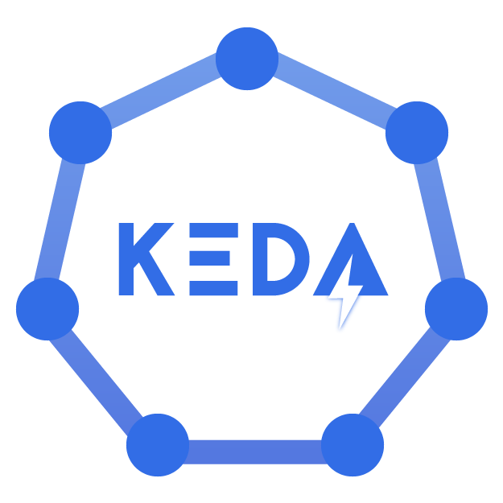

KEDA est un composant open-source qui permet de scaler automatiquement des workloads Kubernetes.
Il est possible de l'utiliser pour scaler des applications qui consomment des messages Kafka.
Dans cet article, nous allons voir comment créer un scaler Kafka avec KEDA.



<!-- truncate -->

✨ Pour créer un scaler Kafka avec KEDA, il suffit de créer un fichier yaml avec la configuration suivante:

```yaml
apiVersion: keda.sh/v1alpha1
kind: ScaledObject
metadata:
  name: kafka-scaledobject
  namespace: default
spec:
  scaleTargetRef:
    name: azure-functions-deployment
  pollingInterval: 30
  triggers:
    - type: kafka
      metadata:
        bootstrapServers: localhost:9092
        consumerGroup: my-group       # Make sure that this consumer group name is the same one as the one that is consuming topics
        topic: test-topic
        # Optional
        lagThreshold: "50"
        offsetResetPolicy: latest
```
*Cette exemple est valable si votre cluster Kafka n'a pas d'authentification SASL/TLS.*

📖 Documentation en ligne: https://keda.sh/docs/2.13/scalers/apache-kafka/